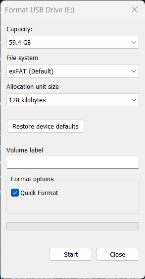
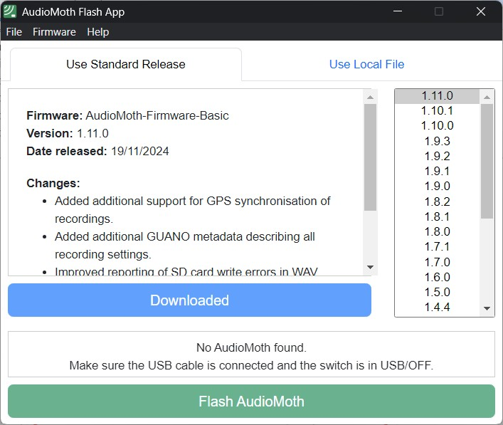

# Step 1: Sensor Preparation

This guide describes how to prepare an AudioMoth sensor prior to field
deployment.

## Required Applications

Download the following applications from [Open Acoustic
Devices](https://www.openacousticdevices.info/applications):

-   **Flash App** (desktop) – update firmware

-   **Configuration App** (desktop) – load recording schedule

-   **Time App** (desktop) – set device clock

-   **Chime App** (mobile) – set clock in the field (from the iPhone app
    store or Google Play store)

::: tip
Ensure all applications are updated. Firmware and Time apps usually do
not require frequent updates.
:::

## Prepare the microSD Card

AudioMoths require a microSD card to record.  The creators of audiomoth have tested many cards and have found that `Sandisk Extreme UHS Speed Class 3 (U3) microSDXC` cards are the most energy efficient.  See the [SD Card Guide](https://www.openacousticdevices.info/sd-card-guide) for more info. 

1.  Insert microSD card into your computer (you will need a microSD card
    adapter).

2.  Format the card to **EXFAT**.

::: warning
This erases all data on the card.
:::

### Windows Formatting Instructions {#sec-windows-formatting-instructions .step}

1.  Insert the microSD card into your computer using an microSD to SD
    Card adapter.

2.  Open **File Explorer** and locate the card under **This PC**.

3.  Right-click the microSD card and select **Format…**.

    

4.  In the **File System** dropdown, choose **exFAT**.

5.  Leave **Allocation unit size** set to **Default**.

6.  Ensure **Quick Format** is checked.

7.  Click **Start**.

8.  When the confirmation dialog appears, acknowledge that all data will
    be erased.

9.  After formatting completes, click **OK**..

Safely eject the card.

## Prepare the AudioMoth Unit

1.  Remove the device from its housing.

2.  Move the switch to **USB/Off**.

    

3.  Remove old batteries and microSD card.

4.  Insert **three new AA batteries** (same brand and type).

5.  Insert the freshly formatted microSD card.

6.  Connect the AudioMoth to the computer via USB.

## Update Firmware

Use the most up-to-date firmware version unless you need an old version
for some reason. The versions will be listed in the "Flash App".

1.  Open the Flash App.

    

2.  Download the latest firmware.

3.  Click **Flash AudioMoth**.

4.  Wait for confirmation that flashing is complete.
