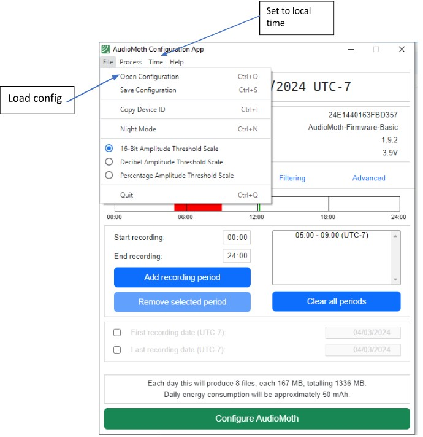

# Step 2: Programming the AudioMoth

## Load Configuration

1.  Open the **Configuration App**.

    

2.  Load your configuration file: **File → Open Configuration**.

3.  Set the device clock display: **Time → Local**.

4.  Adjust settings:

### Main Settings

Below are some recommended settings for standard bird monitoring projects

-   **Sample rate:** 32 kHz

-   **Gain:** Medium

-   **Sleep duration:** 9 min

-   **Recording duration:** 1 min

-   **Schedule:** 00:00–24:00 (set in the local timezone e.g. UTC−7)

-   **Filtering:** None

### Advanced Settings

-   Disable: “Require Chime App”
    - The chime app (smartphone) can be used to reset the clock in the field after changing batteries. However, we do not want to require it to be used for sensors that already have datetime set correctly (ie, upon initial deployment). 

-   Enable: “Use device ID as prefix in WAV filename”

-   Leave all other boxes unchecked.

-  Click **Configure AudioMoth**.

-  Wait for the button to return to the ready state.

-  Eject the device safely.

## Expected Runtime

-   **Storage:** ~1336 MB/day → 64 GB ≈ 49 days

-   **Battery:** ~30 days with 3×AA alkaline

-   Typical deployments: 3–6 weeks depending on site conditions.

## Set Device Time

If you have already programmed the audio moth and the batteries have been installed continuously since programming, the audiomoth clock should already be set correctly. However, if the batteries have been removed at some point, you can use the Time App to set just the clock.

1.  Open the **Time App**.

2.  Click **Set Time** to sync to your computer's local time.

    -   The AudioMoth will store time in **UTC**.

If you see a warning about fast clock drift, verify the time on your AudioMoth manually - this
warning is often incorrect.

## Pre-deployment Sanity Check / Test

Before sending any AudioMoth into the field, perform a quick functional
check to ensure the device, SD card, and configuration are working as
expected. These tests take less than two minutes per unit and prevent
most deployment failures.

1.  **Insert batteries and SD card**  
    Confirm the SD card clicks securely into place and the battery
    contacts are clean.

2.   **Confirm correct configuration**  
    Connect the device to the AudioMoth Config App and ensure the
    intended *sample rate*, *gain*, *schedule*, and *timezone* are
    applied. Verify that the device time is within a few seconds of the
    computer clock. Then disconnect the AudioMoth from your computer.

3.   **Arm the device** 
    Switch to **CUSTOM**, check that the LED flashes as expected (if sensor is between scheduled recordings green light will blink slowly, if currently recording red light will flash quickly). See the [LED guide](https://www.openacousticdevices.info/led-guide) to diagnose unexpected blinking patterns.

4.   **Record a short ambient test clip**  

:::tip
See the [Testing Acoustic Sensors](guides/guide-audiomoth/step-7-testing-sensors) for the recommended testing workflow.
:::

Leave the unit running for ~5–10 seconds while speaking at a "normal" volume. Then switch to USB/OFF and inspect the SD card:

    -    A new WAV file should be present.
    -    The file should have the correct timestamp.
    -    Playback should contain your voice clearly.

5.   **Inspect housing fit**\
    Place the device in its intended housing and confirm that:

      -   No rattling occurs.
      -    The microphone port is unobstructed.
      -    Orientation marks are visible or labeled.

6.   Any device that fails a sanity check should not be deployed until
    the issue is resolved.
    
## Choosing Sample Rate, Gain, and Schedule Settings

Selecting the appropriate recording settings depends on the target taxa, background noise levels, storage constraints, and project goals.

### Sample Rate Selection

| Study Aim / Target Taxa | Recommended Sample Rate | Notes |
|-------------------------|--------------------------|-------|
| General biodiversity (birds, mammals) | **24–32 kHz** | Balanced file size vs. frequency coverage. |
| Songbirds, frogs | **32–48 kHz** | Captures energy up to ~24 kHz, useful for harmonics. |
| Bats or very high-frequency insects | **≥192 kHz** | Required for ultrasonic signals; large storage and battery impact. |
| Low-frequency noise or marine use | **8–16 kHz** | Sufficient for low-frequency signals; minimizes battery and storage use. |

**Rule of thumb:** Choose the *lowest* sample rate that still captures the highest frequency of interest (sample rate ≥ 2 × maximum frequency).

---

### Gain Setting Guidance

- **Low gain** is best for high-noise environments or loud species.
- **Medium or high gain** may be useful for:
  - quiet forests,
  - distant calls,
  - faint signals (small passerines, rodents, some frogs).
- High gain increases the risk of **clipping**, especially during rain, wind, or loud species (hornbills, baboons, gunshots).

If unsure, run two devices with different gain settings for 24 hours and compare Signal-to-Noise Ratio (SNR).

---

### Scheduling Considerations

- **Continuous recording:** Best for unknown vocalization patterns; highest battery and storage cost.  
- **Duty-cycled recording:** Useful for long-term monitoring (e.g., 1 min every 10 min).  
- **Time-of-day schedules:** Target crepuscular or nocturnal species (owls, bats, some insects).  
- Avoid **very short cycles** (\<1 min files), which increase file fragmentation and SD card wear.

:::tip
Match the schedule to when the species vocalizes — dawn chorus, nocturnal peaks, rainfall cycles, etc. This can extend deployment duration.  If target species are unknown or if you are interested in general biodiversity monitoring, it is often best to set up a recording schedule that operates 24 hours a day (1 every 10 min/24hrs).
:::
