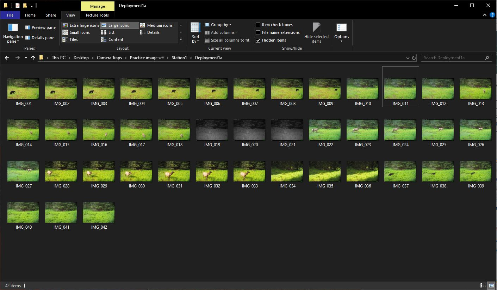

# Step 1: Organizing Imagery

It’s important that images are carefully organized. All images that are to be analyzed together, or your "image dataset", should have the same root folder and can be separated into sub-folders under the root. Below is a suggested folder structure, however it may vary depending on the setup of your project’s deployments and retrievals.

```
ProjectName/
├── Springfield/
│ ├── Deployment_20240319/
│ │ ├── Camera1/
│ │ └── Camera2/
│ ├── Deployment_20240425/
│ │ ├── Camera1/
│ │ └── Camera2/
├── Fairfax/
│ ├── Deployment_20240512/
│ │ ├── Camera1/
...
```

In this example, a new retrieval folder is created for each camera check. The retrieval folders serve as the root folders for your image dataset. All photos from an SD card should be placed at the lowest folder level. For instance, photos from an SD card pulled from Camera 1 on March 19, 2024, would be copied into `Springfield/Deployment_20240319/Camera1`. This structure makes it easier to organize new imagery as additional retrievals are added.

:::Important
**Handling SD cards with more than 10,000 images**

Many camera models name images using a four-digit counter (e.g., `IMG_0001.JPG` → `IMG_9999.JPG`).  
When more than 9,999 images are captured on a single SD card, the camera automatically creates an additional folder on the card and continues numbering from `IMG_0001.JPG` again.

When copying imagery from the SD card:

- If there is **only one folder containing images**, copy the images directly into the camera folder.
- If there are **two or more folders containing images**, **copy the folders exactly as they appear on the SD card into the camera folder** rather than merging their contents.

Do **not combine the images from multiple folders into a single folder.** Because filenames repeat (e.g., `IMG_0001.JPG`), merging folders can:

- **Overwrite files**, resulting in permanent data loss, or  
- Cause the operating system to rename files (e.g., `IMG_0001 (1).JPG`), making it difficult to determine whether files are duplicates or distinct images.

Preserving the original folder structure ensures that all images are retained and prevents confusion during later processing.
:::


_Example of a Timelapse project folder structure, using the practice image set._

:::info

Once you start a project in Timelapse, the software will create several files in your root folder:

* A project template database (`TimelapseTemplate.tdb`)
* A project data database (`TimelapseData.ddb`)
* A `backups/` directory where Timelapse will periodically make data backups

:::

:::important

Once you begin analysis in Timelapse, do not rename, move, or reorganize any folders or files within the root folder. You _can_ move or copy the root folder itself.

:::
