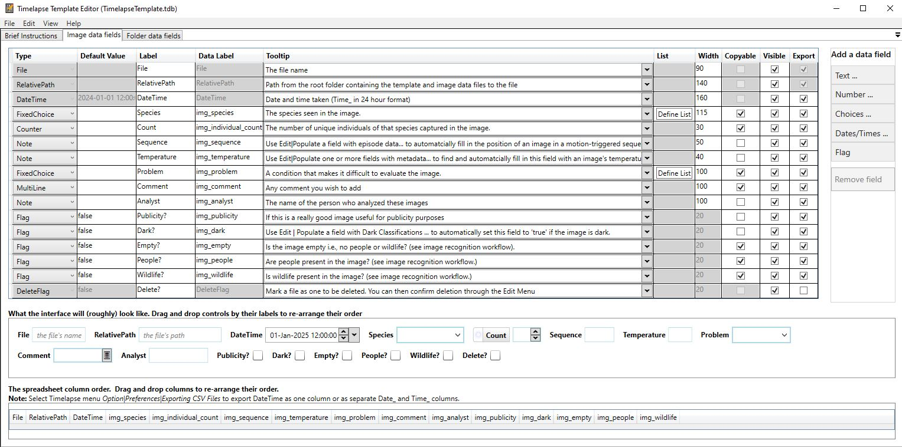

# Step 2: Creating a Timelapse Template

:::note

For detailed instructions, see the [Timelapse Template Guide](https://timelapse.ucalgary.ca/wp-content/uploads/Guides/TimelapseReferenceGuide.pdf).

:::

This step is where you create custom database fields for your project. The Timelapse interface uses the fields defined in the template to structure the database during the image review process. The template must be stored in the root folder of your image dataset (following the folder structure above, this will be the latest retrieval folder).

:::tip

You can use the **Timelapse practice image set** as a basis for getting started. See [Key Resources](./index.md#key-resources) for a link to download this.

:::

_Example of a Timelapse template, using the practice image set._

## How to create a Timelapse Template

1. **Start the Timelapse Template Editor** software. (This is the `TimelapseTemplateEditor.exe` file in your Timelapse directory.)

2. To create a new template: go to **File → New Template**, navigate to the root folder of your image dataset, and save the template with a unique name.

3. The newly created template will include the mandatory data fields required by Timelapse. You do not need to modify these.

4. Use the **Add** button on the right side of the table to define fields and select a data type:
   - **Notes**: Free text
   - **Counts**: Integers
   - **Flags**: True/false
   - **Choices**: Dropdown menu with predefined options

**Suggested fields:**

- `Indiginous Name` (**Choices**) — count the species found in the image
- `English Name` (**Choices**) — English name for the species found in the image (optional)
- `Scientific Name` (**Choices**) — Scientific name for the species found in the image (optional)
- `Count` (**Counts**) — count the number of species
- `Notes` (**Notes**) — for reviewer comments
- `Favorite` (**Flag**) — to mark notable images

:::tip

You don't have to use scientific names for your species dropdown if you don't want to. You can use indigenous names instead, and later join those with scientific names (if so desired).

:::

:::info

Your project template data is stored in a file called `TimelapseTemplate.tdb`. Please make sure this file is always at the root level of your imagery set. (Timelapse will create it there when you start a new project.)

:::