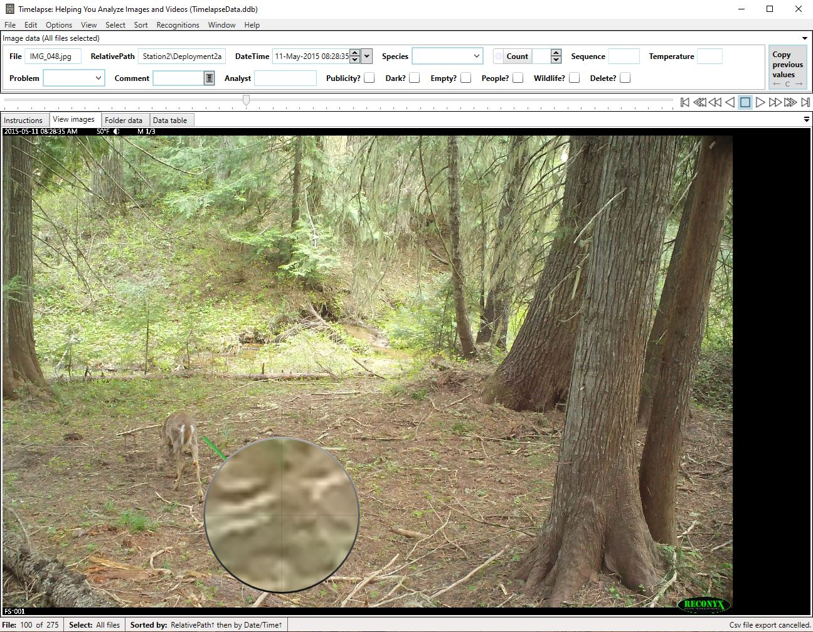

# Step 4: Reviewing and Tagging Images

The process of reviewing and tagging photos will vary depending on your image dataset and project goals. The steps below outline a generalized workflow for tagging images.

1. **Start the Timelapse software.** (This is the `Timelapse.exe` file in your Timelapse directory.)

2. **Load your template:**
   - Go to **File → Load template, images, and videos**.
   - Navigate to the root folder of your image dataset and select the Timelapse template.
   - This will load your images into Timelapse.

3. **Review and tag images:**
   - Move through each image (using the arrow keys **← →**), identifying all animals present.
   - If your camera traps were set up to shoot multiple images each time it was triggered, you can move forward or back an "episode" (all images in a sequence) using **ctrl+→** or **ctrl+←**
   - the **c** key will copy the the values from the previous image and fill them in on the current image.  This only applies to "copyable" fields in the Timelapse template for your project.
   - the **↑** and **↓** keys will show the difference between the current image and the next or previous image highlighting pixels that changed.  This is helpful for spotting where an animal is in the image.
   - If more than one species appears in an image or video, use **Edit → Duplicate this record** (`Ctrl+D`).
       - This will create an additional entry in the database, allowing you to annotate each species separately.
   - You can use **Select → Custom selection...** to filter what images are viewed to focus on specific metadata fields (folders, Favorited images, date/time range, etc)
   - Timelapse has a built in image adjuster that can be used to change the contrast, brightness, and apply temporary transformations to the current image.  This option can be accessed **Options → Temporarily adjust image appearance**.

_Example of tagging images in Timelapse using the practice image set._
