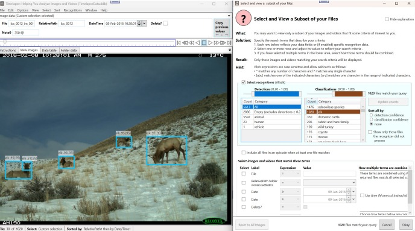

# Step 5: Using Image Recognition

:::note

Please see the [Timelapse Image Recognition Guide](https://timelapse.ucalgary.ca/wp-content/uploads/Guides/TimelapseImageRecognitionGuide.pdf) for the most recent and detailed information. Please also see [the Timelapse image recognition page](https://timelapse.ucalgary.ca/imagerecognition/) for a video tutorial and a practice image set.

:::

Image recognition can dramatically speed up your camera trap workflow by automatically detecting and classifying animals, people, and vehicles in your images. While not perfect, it helps you quickly identify empty images, focus on specific species, and bulk-tag similar detections.

  
_Example of Timelapse showing bounding boxes around detected entities, using the practice image set._

:::tip
Image recognition isn't a magic bullet - it's a tool to augment, not replace, careful review. Always verify recognition results, especially for critical data.
:::

## What is Image Recognition?

Image recognition uses machine learning models to automatically inspect and analyze your images. It can:

- **Detect** whether something is present (animal, person, vehicle, or empty)
- **Classify** specific species when using appropriate models
- **Locate** entities using bounding boxes drawn on your images
- **Assign confidence scores** indicating likelihood of correct identification

The process works on videos too - frames are extracted and analyzed as images, with results showing the position within the video.

## Installing and Running AddaxAI (recommended)

Timelapse integrates with **AddaxAI** (formerly called EcoAssist), which provides an easy interface to Microsoft's widely-used [MegaDetector](https://github.com/agentmorris/MegaDetector) AI recognition system. MegaDetector is specifically designed for wildlife camera trap images and is one of the most reliable detection systems available for ecological research.

### Installation

1. **In Timelapse, select** `Recognizer → AddaxAI Image Recognizer → Install AddaxAI image recognizer`

2. **Follow the browser instructions** that appear. The installation takes 10-15 minutes as it downloads required packages.

3. **Choose your recognition model** when AddaxAI starts:
   - _None_: Basic animal/person/vehicle detection (useful for any region)
   - _SpeciesNet_: General-purpose species classification
   - _Regional models_: Specific to certain geographic areas and species

### Running Recognition

1. **Start recognition** with `Recognizer → AddaxAI Image Recognizer → Run AddaxAI on this folder`

2. **Select the folder** containing images you want to process (usually your root image folder)

3. **Choose your model** and species of interest in the AddaxAI interface

4. **Click "Start processing"** and wait for completion

5. **Import results** using `Recognizer → Import recognition data for this image set`

AddaxAI generates a `timelapse_recognition_file.json` file containing all detection and classification data.

## Understanding Recognition Results

### Bounding Boxes and Labels

After importing recognition data, you'll see:

- **Colored bounding boxes** around detected entities
- **Labels** showing detection type (animal, person) or species classification
- **Confidence scores** indicating likelihood of correct identification
- **Different colors** for different entity types (red for person, blue for animal)

### Confidence Levels

Recognition confidence helps you understand reliability:

- **High confidence (0.8-1.0)**: Likely correct, occasional errors
- **Medium confidence (0.2-0.8)**: More suspect, increasing false positives
- **Low confidence (0.0-0.2)**: Probably incorrect

:::warning
Confidence thresholds vary between different recognition models. Use the visual results to determine what confidence levels work best for your images.
:::

## Recognition-Based Workflow

A systematic approach maximizes efficiency while maintaining accuracy:

### 1. Setup Your Template

Include flag fields in your template for:
- `Empty` - images with no animals or people
- `Wildlife` - images containing animals
- `Person` - images containing people
- `Species` - for detailed species classification

### 2. Process Empty Images

1. **Select empty images** using `Select → Custom Selection → Recognitions → Empty`
2. **Bulk-tag as empty** using the `Empty` field and `Copy to all`
3. **Review and correct** false negatives (missed animals/people)
4. **Adjust confidence ranges** to capture more potential empties

### 3. Identify People and Vehicles

1. **Select person detections** with reasonable confidence
2. **Bulk-tag and review** for privacy compliance or separate analysis
3. **Repeat for vehicles** if relevant to your project

### 4. Classify Wildlife

1. **Select animal detections** above your chosen confidence threshold
2. **Use species classifications** if available to bulk-tag common species
3. **Review high-confidence classifications** first, then lower confidence
4. **Manually classify** remaining untagged animals

### 5. Final Review

1. **Check for unprocessed images** using the custom selection
2. **Verify all images are classified** appropriately
3. **Export your data** as usual

## Advanced Features

### Video Recognition

- Recognition samples video frames (default: every 1 second)
- Use the **"Best"** button to jump to highest-confidence detection
- Bounding boxes animate during video playback

### Incremental Processing

For ongoing projects:
- Run AddaxAI on new sub-folders as you add images
- Import additional recognition files to merge with existing data
- Maintain separate recognition files in each folder

### Custom Selection Options

- **Sort by confidence** to review from highest to lowest accuracy
- **Episode selection** includes all images in an episode when one matches
- **Random sampling** for quality checking large datasets

## Common Recognition Errors

Understanding limitations helps you work more effectively:

- **False positives**: Detections where nothing exists
- **False negatives**: Missing actual animals or people  
- **Incorrect classifications**: Right detection, wrong species
- **Ambiguous results**: Multiple overlapping detections

## Workflow Tips

:::tip Efficiency Strategies

- **Start with high-confidence detections** to bulk-tag obvious cases
- **Use random sampling** on large datasets to check accuracy
- **Adjust confidence thresholds** based on your error tolerance
- **Create QuickPaste entries** for rapid correction of common errors
- **Delete empty images** if storage space is a concern

:::

---

## Advanced: Using MegaDetector Directly

While AddaxAI provides the easiest way to use image recognition, you can also run [MegaDetector](https://github.com/agentmorris/MegaDetector) directly if you need more control over the process or want to customize parameters.

### When to Use MegaDetector Directly

Consider using MegaDetector directly if you:

- Have a very large number of images (millions) that exceed your computer's capacity
- Need to customize recognition parameters or models
- Want to integrate recognition into automated workflows
- Have technical expertise and specific requirements not met by AddaxAI

### MegaDetector Versions

There are currently two active versions of MegaDetector:

- **[Original MegaDetector](https://github.com/agentmorris/MegaDetector)** (maintained by Dan Morris): Well-established version with extensive community support
- **[Microsoft AI for Good MegaDetector](https://github.com/microsoft/CameraTraps)** (Pytorch Wildlife): Newer development under Microsoft's AI for Good initiative

Both versions work with Timelapse and produce compatible recognition files.

### Technical Implementation

If you choose to run MegaDetector directly:

1. **Install MegaDetector** following the documentation on GitHub
2. **Process your images** using the command-line interface
3. **Generate a JSON file** in the [standard format](https://lila.science/megadetector-output-format)
4. **Import the JSON file** into Timelapse using the recognition import feature

The resulting workflow and capabilities in Timelapse remain the same regardless of whether you use AddaxAI or MegaDetector directly.

---

## Conclusion

Image recognition can reduce manual tagging time by 70-90% when used effectively. The key is finding the right balance between speed and accuracy for your specific project needs.
