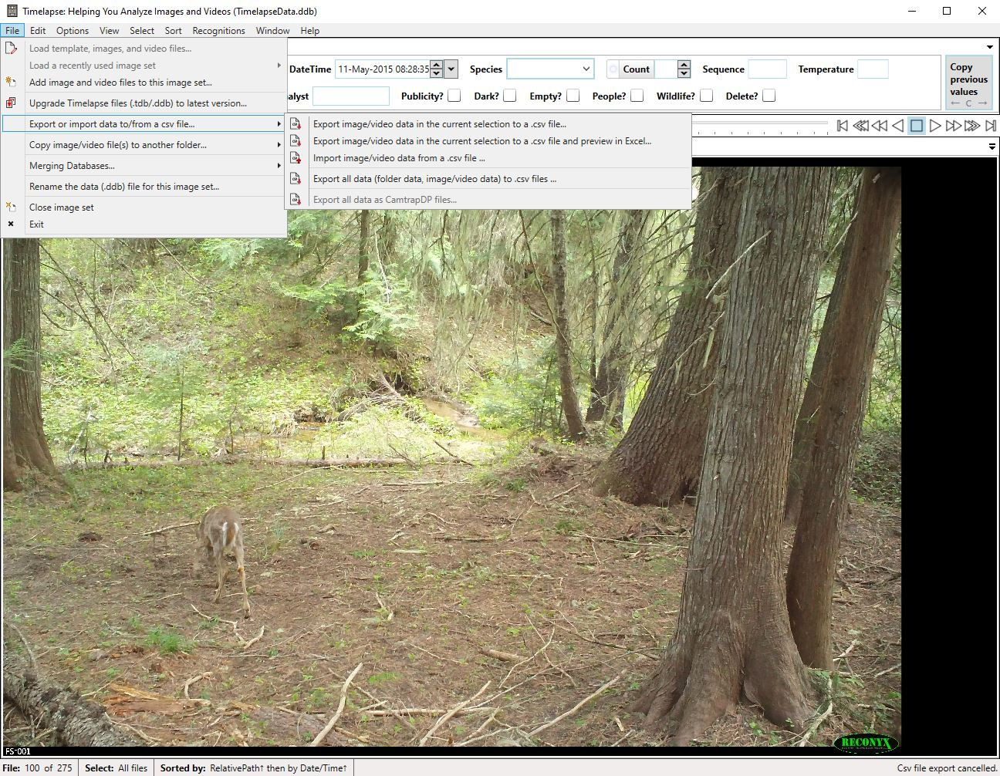

# Step 6: Exporting Annotations

## Export as CSV

All data generated during review is stored locally on your machine. To export:

- Use **File → Export or import data to/from a csv file** within Timelapse.
- You can either choose to export a current selection of your data, or export all data.
- Now your annotations are available as a CSV file for further analysis. Or, you can re-import the data back into a Timelapse project.

_The Timelapse "Export or import data to/from a csv file" menu._

## Integrate with Guardian Connector

🚧 Under construction