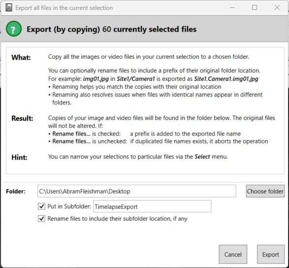

# Appendix 2: Exporting Images for GC Wildlife Viewer

`gc-wildlife-viewer` requires three primary data sources to function:

1. A CSV exported from **Timelapse.exe** (`ImageData.csv`)  
2. A folder of images exported from Timelapse (`TimelapseExport`)  
3. A folder of thumbnails generated from the Timelapse images (`thumbs`)

This section explains how to generate these files and organize them for the app.

---

## Timelapse Data Export

The raw Timelapse data are stored in a SQLite database. The app, however, uses an **exported CSV** to simplify access. Currently, only **subset selections** of the Timelapse database are supported; full-database exports are not yet supported.

### Exporting a Selection

1. Open **Timelapse.exe** and use the selection menu to choose the subset of images you want to work with. For example:  
- Images marked as **Favorite**  
- Images with non-blank data fields (e.g., `local_name`)  

2. Export the tabular data as a CSV file:  
```
File → Export or import data to/from a CSV file → Export image/video data in the current selection to CSV...
```
Save this file as `ImageData.csv`.

3. Export the corresponding images for the dashboard:  
```
File → Export (copy) Image/Video files to another folder → Copy all Image and Video files in the current selection to...
```

:::important

Its suggested to use the option to "Put in Subfolder" with the subfolder names `TimelapseExport`. 

It is Required to "Rename files to include their subfolder location if any""
Place the exported images in a folder named `TimelapseExport`.


:::

---

## Folder Structure

The app expects the following structure under a root `{images}` folder:
```
images/
├── ImageData.csv
├── TimelapseExport/
│ ├── image1.jpg
│ ├── image2.jpg
│ └── ...
└── thumbs/
```

- `ImageData.csv` → exported CSV from Timelapse  
- `TimelapseExport/` → folder containing the selected images  
- `thumbs/` → folder for generated thumbnails; the app will create this folder automatically if it does not exist

> **Important:** The `ImageData.csv` file is required. If it is missing or modified incorrectly, the app will crash.

---

## File Storage Strategy

To prevent accidental deletion or modification of `ImageData.csv`:

- The app uses **two volume mounts**:  
1. `datalake` – user-accessible; files can be renamed, moved, or deleted via FileBrowser  
2. `gc-wildlife` – admin-only; app reads data from this location

- On startup, the app will check for `ImageData.csv` in the `gc-wildlife` mount (admin-only). If it does not exist, a copy will be made from `datalake` and stored in `gc-wildlife`. All further reads occur from this secure location.

This ensures the app can operate safely even if users modify files in `datalake`.

:::note

If the files in the datalake are updated intentionally, the app-admin must manually update the ImageData.csv in the gc-wildlife data mount.

:::
