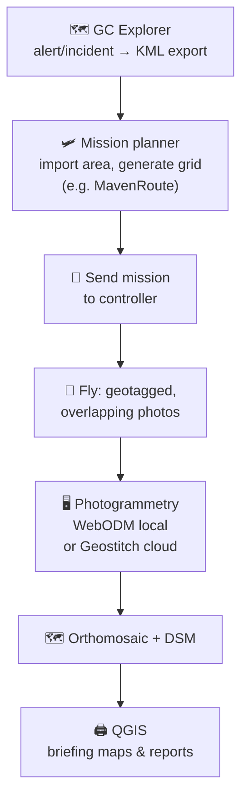

# 🛩️+🗺️ Guide: From Mining Alerts to Drone Maps

## Introduction

When [change detection alerts](/reference/gc-toolkit/gc-explorer/) show new mining activity, the hard part is often distance: a site can be hours from any river or road, and a field expedition costs days of the team's time. Not every alert justifies that trip.

An automated drone flight is a cheap way to "visit" the site without going. The drone flies a planned path, captures multiple overlapping geotagged photos, and software stitches them into an **orthomosaic** — one continuous, high-resolution map. That map answers most of the questions a field visit would: what happened here, how large is it, are machines working, which direction is it growing. The team then decides whether the in-person trip is really needed.

This workflow goes hand in hand with [Preparing Mining Alert Field Briefings](/guides/land-monitoring/guide-mining-alert-field-briefings/): same alerts, same briefing packets and reports — only now the site pages are drawn from centimeter-resolution drone maps instead of satellite imagery.



This guide assumes you already work comfortably with QGIS and GC Explorer, and that your organization has a mapping-capable drone and a pilot who flies it under your national drone rules.

## Step 1: Export the mining site from GC Explorer

In the **Alerts Dashboard** of [GC Explorer](/reference/gc-toolkit/gc-explorer/), review what has accumulated since your last round, discard artifacts, and export the sites worth flying as **KML**:

- **batch export** of all visible alerts (respecting the time filter),
- a **single alert** clicked on the map,
- or a whole **[incident](/reference/gc-toolkit/gc-explorer/incidents/)** if the site has triggered alerts several times.

KML is the format to use here — mission planners accept a KML polygon or outline directly as the survey area. The GeoJSON export from the [field briefing guide](/guides/land-monitoring/guide-mining-alert-field-briefings/) remains the right choice for the QGIS analysis; the two exports describe the same site and will align exactly, since everything Guardian Connector publishes is in WGS84.

:::tip
Size the flight against what you need to *see*. A 2-hectare operation and a 20-hectare pond are different missions — if in doubt, fly the alerted area plus a margin of 30–50 m on every side, so the map shows context the satellite alert cannot, and/or monitor the automated flight as it happens to spot any change that would be worth capturing.
:::

## Step 2: Plan the mission

Any planner that turns a polygon into a grid of photos will do. This guide walks through **MavenRoute**, the web mission planner of the [MavenPilot](https://www.mavenpilot.com/) ecosystem — but every step is the same in any other tool: open an area, set altitude and overlap, generate the grid, send it to the controller.

### Import the site

Create a new **photogrammetry / mapping** mission in the planner and import the alert's KML as the survey area. Rotate the grid to run along the area's long axis — fewer turns, shorter flight, same coverage.

### Set the parameters

| Parameter | Rule of thumb for mining alerts |
| --- | --- |
| **Overlap** | ~50% front and side is enough for a clean orthomosaic of a site. |
| **Altitude** | Choose the height by the detail you must resolve, not the other way around: fly low enough that vehicle tracks, pit edges, or machinery are identifiable, but as high as consistent with that, so one flight covers the site. Altitude directly sets your resolution (ground sample distance) — ~300 meters is usually the sweet spot. |
| **Mission size** | Keep each mission inside **one battery**: the grid should finish with comfortable reserve, and a site that needs a battery swap mid-mission produces two half-covered maps. If the area is too big, split it into two missions over adjacent halves rather than pushing one flight. |

:::tip
Save the mission file. Flying the *same* path over the same site months later gives you directly comparable maps — that is how a drone flight turns into repeated monitoring instead of one-off documentation.
:::

### Adjust and export to the controller

Preview the generated grid over satellite imagery and adjust by hand if a line obviously misses the active area. Then move the mission from planner to controller:

- **In the Maven ecosystem**: transfer from MavenRoute to the **Maven** app on the controller via MavenShare; for DJI Fly aircraft that cannot run third-party apps, export the mission as **KMZ** and push it to the controller with the free **MavenBridge** desktop tool.
- **Otherwise**: use your drone's native path — DJI Pilot 2 imports planned routes and has built-in mapping missions, enterprise platforms like eBee or Wingtra have their own planners.

:::note
DJI Fly gives no way for outside tools to *create* a mission, so **MavenBridge works by replacing a mission that already exists on the controller**. Do this once in advance: save any small waypoint mission in DJI Fly, then let every MavenBridge transfer overwrite that slot with your planned grid — the controller always holds your latest mission. One catch: the mission to be replaced must be stored *physically on the device*, not in your DJI cloud; if MavenBridge does not list it, open the mission once in DJI Fly and close it, which downloads it locally. The [MavenBridge documentation page](https://www.mavenpilot.com/mavenbridge/) walks through the full transfer (with a demo video), and Maven's [video tutorial hub](https://www.mavenpilot.com/tutorial/) covers the planner-to-flight workflow end to end.
:::

:::note
The planning-app field moves quickly and includes DroneDeploy, Pix4Dcapture, UgCS, Dronelink, QGroundControl and more; see the mapping-software comparison in the [UAV Coach drone mapping guide](https://uavcoach.com/drone-mapping/) for a current overview.
:::

## Step 3: Fly, and check before you leave

The mission now flies itself — altitude, speed, photo intervals exactly as configured. That automation is the whole point, because **photogrammetry only succeeds if every photo meets the conditions stitching depends on**: enough overlap with its neighbors, consistent scale from a constant height, frames sharp enough to match, and accurate GPS stamps. When someone flies a site manually and shoots by feel, one or more of those conditions usually breaks *silently* — and you discover it only at processing time, far from the site, when the map has holes or refuses to align. A planned grid is a guarantee, set in advance, that the dataset will produce a map.

In the field:

- Camera at **nadir** (straight down), interval shooting controlled by the mission — don't override it with manual frames.
- Watch the screen: confirm photos are actually being taken at the planned rate.
- Before packing up, glance over the captured coverage. A gap or a run of blurred frames is fixable by flying again *now*, and impossible to fix once you are hours from the site.

## Step 4: Process the photos into a map

Stitching (structure-from-motion photogrammetry) turns the images into:

- an **orthomosaic** (GeoTIFF) — the map you will actually use,
- a **DEM** (elevation model) — optional, if you care about pit depth or stockpile volumes,
- a quality **report** and the raw georeferenced point cloud, for the rare cases that need them.

Commercial tools (Pix4D, Metashape, DJI Terra, DroneDeploy) do this too; this guide focuses on the free, open-source **OpenDroneMap** family: the command-line engine **ODM**, the browser interface **WebODM**, and the network API **NodeODM**. There are multiple other tools in this space that we won't cover — the choice matters less than the capture you bring into them.

### Locally, on a beefy computer

Processing is memory-hungry; the honest rule is *more photos → more RAM*.

The easiest setup is Docker — drop the images into a dataset folder and run:

```bash
docker run -ti --rm -v /datasets:/datasets opendronemap/odm \
  --project-path /datasets site-a3
```

or start the WebODM interface ([installation guide](https://webodm.org/download/)) and create the task in the browser: upload the images folder, keep default options, and open the result when the task finishes. The orthomosaic is always at `odm_orthophoto/odm_orthophoto.tif`.

:::tip
For a quick triage map, use the **fast-orthomosaic** setting (`--fast-orthomosaic`) plus `--dsm` only if you need elevations. You get a usable site map at a fraction of the time; reprocess at full quality only for sites that prove they matter.
:::

### In the cloud, without the hardware

If no team computer can hold the RAM, [Geostitch](https://geostitch.io/) is a free web front end that drives the same ODM engine (via NodeODM): create an account, upload the flight images, and choose where the processing happens — your own NodeODM node if you have a strong machine, a server rented from them per month, or **pay-per-job** cloud compute. The interface, projects, and exports cost nothing; processing does — pay-per-job uses prepaid credits whose cost scales with image count and quality preset, and rented servers start at a fixed monthly fee. Even so, the bill is a small fraction of the cost of a workstation capable of stitching the same datasets locally, and you never pay for hardware sitting idle between expeditions.

:::note
Cloud processing still requires *uploading* — a few hundred photos is 5–20 GB. In the field, bring the images home on the SD card; run from there, whether locally or in the cloud. Slow field internet breaks the workflow either way, not just the cloud option.
:::

## Step 5: Load it in QGIS, print it, report it

Keep the same folder discipline as the briefing guide — one folder per site round, project pointing at relative paths:

```text
2026-09_site-a3/
├── alerts/            # KML/GeoJSON from GC Explorer
├── drone/
│   ├── images/        # untouched originals from the SD card
│   └── odm/           # processing output (orthophoto, DSM, report)
├── round.qgz
└── printed/           # briefing packet PDF
```

Load `odm_orthophoto.tif` as a raster layer (Layer → Add Layer → Add Raster Layer). It carries its coordinates, so it lands exactly over the alert polygon — which is itself the first finding: a cm-scale map either confirms or kills the alert, and often shows the true footprint extending past what the satellite flagged.

The main job is printing. Swap the orthomosaic in **under the existing print layouts** from the [field briefing guide](/guides/land-monitoring/guide-mining-alert-field-briefings/): the same per-site pages the council already recognizes — title, labels, scale bar, legend — now show the site in enough detail to count machines and read the access trail. That is already the whole payoff; resist adding work.

:::info Optional analysis — only when a question remains
If the map on paper still leaves a question open, QGIS can answer two that matter for mining reports: measure the disturbed area in hectares (Field Calculators / *$area* on a digitized footprint), and digitize the **verified** outline to replace the alert polygon when you record the site in an [incident](/reference/gc-toolkit/gc-explorer/incidents/). Anything beyond that — volumes, depth change between flights — needs the DSM and belongs in a separate, later project.
:::

## What's next

- [Preparing Mining Alert Field Briefings](/guides/land-monitoring/guide-mining-alert-field-briefings/) — the companion workflow this one feeds
- [Use your data in QGIS](/reference/common-workflows/use-your-data-in-qgis/) — Guardian Connector data into QGIS
- [Incidents in GC Explorer](/reference/gc-toolkit/gc-explorer/incidents/) — record the verified footprint and close the loop

## 📚 Further reading

- [MavenPilot / MavenRoute](https://www.mavenpilot.com/) — the example planner used here, with [MavenShare](https://www.mavenpilot.com/maven-ecosystem/) and [MavenBridge](https://www.mavenpilot.com/mavenbridge/) for controller transfer
- [Maven video tutorials](https://www.mavenpilot.com/tutorial/) — end-to-end walkthroughs of the planner-to-flight workflow
- [UAV Coach: Drone Mapping guide](https://uavcoach.com/drone-mapping/) — regularly updated comparison of mapping drones and software
- [OpenDroneMap documentation](https://docs.opendronemap.org/) — installation, options, and outputs
- [Geostitch](https://geostitch.io/) — free front end for ODM processing on your own node, a rented server, or pay-per-job
- [QGIS Documentation](https://docs.qgis.org/)
