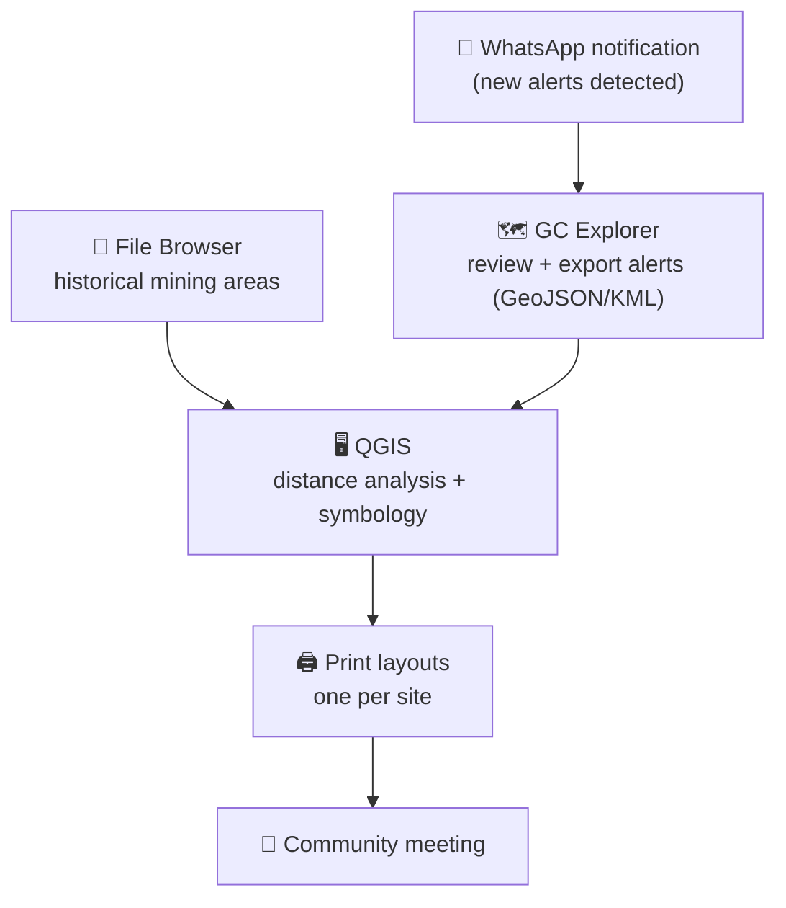

# GC Explorer: Preparing Mining Alert Field Briefings

## Introduction

:::important
This is ONLY for Guardian Connector users who benefit from receiving mining alerts -- plus historical data -- from a proprietary alerts provider made available by CMI.
:::

When [change detection alerts](/reference/gc-toolkit/gc-explorer/) show new mining activity in a territory, the next step is usually a field visit: confirming what happened on the ground, talking to the nearby village, and deciding what to do.

A site visit goes much better when the team and the local community can look at the same map. This guide walks through a complete workflow for turning raw alerts into **printed briefing packets** — one map per mining site, with the analysis already done: where the site is, how far it is from the river, and how far it is from the village.



This guide is written for the people who **lead the monitoring process**: you should be comfortable opening data in QGIS, understand how GPS coordinates work, and have a basic familiarity with [KoboToolbox](/reference/core-integrations/kobotoolbox/) and KoboCollect for field data collection.

## Step 1: Alerts reach you

New change detection alerts can be pushed to the monitoring team automatically. In a typical Guardian Connector setup, a script in [GC Scripts Hub](/reference/gc-toolkit/gc-scripts-hub/) sends a **WhatsApp message** (via [Twilio](/reference/gc-toolkit/externally-hosted/twilio/)) whenever new alerts are published:

> *X new change detection alert(s) have been published on your alerts dashboard for the date of MONTH YEAR. The following activities have been detected in your region: DESCRIPTION. Visit your alerts dashboard here: https://explorer.\[community\].guardianconnector.net/alerts/alerts ...*

How you react to that message depends on your workflow:

- **Reacting in the moment** — if a rapid-response protocol exists, the notification is the trigger: the message includes a count, a description, and a direct link to the alerts dashboard, so the team can triage immediately.
- **Planning a round (most common)** — usually you do not chase individual alerts. Instead, you open GC Explorer **before planning a patrol round**, look at everything that has accumulated since the last visit, and decide which sites to cover in one trip.
- **Interim reporting** — if your council wants updates between visits, the alert statistics from the dashboard (number of alerts, hectares affected) can be exported and forwarded as a short report, even before a field visit happens.

:::tip
Agree as a team on a simple cadence — for example, review the dashboard weekly and turn each review into one planned round. That way alerts do not pile up unnoticed between expeditions.
:::

## Step 2: Review the alerts in GC Explorer

Open the **Alerts Dashboard** in [GC Explorer](/reference/gc-toolkit/gc-explorer/). This is where you decide *which sites matter for the upcoming visit*.

- Use the **time filter** to show only alerts since your last round. The filter applies both to the map and to downloads, so you export exactly the subset you reviewed.
- Click individual alerts to inspect the **before-and-after imagery** and the reported date and area. Not every alert is a mining site — some are cloud or shadow artifacts. Discard what does not hold up.
- If one mining operation produced several alerts over time, group them into an **[incident](/reference/gc-toolkit/gc-explorer/incidents/)**. An incident names the event (e.g., "Screaming River benching, August"), attaches metadata such as activity type and suspected responsibility, and lets you download the whole group at once. Incidents are also a lightweight record-keeping habit.

## Step 3: Export alerts as GeoJSON or KML

From the Alerts Dashboard you can download alerts in **CSV**, **GeoJSON**, and **KML**:

- **Batch download** all visible alerts (respecting the time filter),
- **Download a single alert** by clicking it on the map,
- **Download an incident** — all linked alerts at once as GeoJSON, plus the incident metadata as CSV.

For this workflow, choose **GeoJSON** (it imports cleanly into QGIS and keeps all attribute fields). KML is handy when you just want to show someone the sites quickly in Google Earth.

## Step 4: Get the historical mining areas

New alerts only tell half the story. **Older mining areas** — the footprint of everything mined before this alert window — let the council see how much is new and in which direction mining is advancing.

In some cases, historical mining polygons may already available in the [File Browser](/reference/gc-toolkit/filebrowser/) of your Guardian Connector instance. They can be **provided on request** by your technical support partner. Download them as GeoJSON or Shapefile into the same trip folder.

:::note
If old mining areas are missing from your File Browser, ask your support partner which mining layers are already configured for your instance and how often the historical footprint is refreshed.
:::

## Step 5: Initial analysis in QGIS

Now bring everything together in [QGIS](/reference/companion-applications/qgis/) and add the two numbers every council member asks about: **how close is this to the river, and how close is this to the village?** All Guardian Connector exports arrive in **WGS84 (EPSG:4326)**, the same system GPS uses, so coordinates will match what your devices record.

### Load the layers

1. **Layer → Add Layer → Add Vector Layer** and load the alert export (GeoJSON), the historical mining layer, a **river line layer**, and a **village point layer** for the area you are visiting.
2. Right-click each layer → **Zoom to Layer** to confirm they overlap where you expect.

If you do not yet have river and village layers for your territory, ask your support partner — most instances keep reference layers — or digitize the main village centroid once from your own records. It is worth it: you will reuse these layers for every future round.

### Measure distances

Run the analysis **per site (alert polygon)**, choosing the measurement that matters for your territory — distance to river, distance to village, or both:

- **Distance to river** — Processing toolbox → *Distance to nearest hub* (set alerts as the source layer and rivers as the hub layer), or *Distance matrix* (linear distance between each alert centroid and the nearest river vertices). Mining within a short distance of the river often means water contamination risk and access by boat — flag these sites for closer inspection.

  To show these distances **as labels next to each site** instead of hiding them in the attribute table:

  1. Right-click the alerts layer → **Properties** → **Labels** tab.
  2. Change *No Labels* to **Single Labels**, and pick the distance field (e.g. `HubDist`) from the **Value** dropdown — click **Apply** and the numbers appear on the map.
  3. Click the **ε (Expression)** button next to *Value* to build a richer label, e.g. `concat(round("HubDist"), ' m to river')`.
  4. Under **Text → Buffer**, add a light buffer so the labels stay readable over satellite imagery.

  See the [Labels lesson in the QGIS Training Manual](https://docs.qgis.org/latest/en/docs/training_manual/vector_classification/label_tool.html) for the full walkthrough, or watch the video [How to Label layers in QGIS](https://www.youtube.com/watch?v=6qCuuJFCcXQ) (Lesson 4 of the QGIS Tutorial series). The same labels carry over automatically into the print layouts in Step 6.

- **Distance to village** — same tools with the village points as the hub/target layer. Sites very close to the village raise different questions (road access, encroachment on used lands) than remote sites (who is getting in, how).

### Make it readable

Before laying out the print maps, get the visuals right — they carry most of the message:

- **New mining alerts** in a strong, warm color (red/orange); **historical mining** in a muted grey outline. The contrast between "what we knew" and "what is new" is the core of the briefing.
- Add **waypoints or lines the observer will actually use**: the nearest access point on the river, the trail or route you plan to take, and any previously verified sites.
- Mark **anything anomalous**: sites where the alert looks wrong, sites that repeat month after month (active and expanding), and sites suspiciously close to the village. These are what the observer should confirm or deny on the ground.

### Recommendation on keeping track of your GIS files

Geospatial work is easy to lose track of: a QGIS project file (`.qgz`) does **not** contain your data — it only stores *references* to where the files sit on your computer. Exports scattered across a Downloads folder or lost in email chains quickly turn into broken layers and "which file was that?" six months later. A few habits from the start keep every round reproducible:

- **One folder per trip**, with the same simple structure every time:

  ```text
  2026-09_jatapu-round/
  ├── alerts/             # GeoJSON exported from GC Explorer
  ├── historical/         # historical mining layer from File Browser
  ├── reference/          # rivers, villages — reused across rounds
  ├── working.gpkg        # analysis outputs (joined distances, etc.)
  ├── round.qgz           # the QGIS project
  └── printed/            # exported PDF packet
  ```

- **Never edit the original exports** — leave them exactly as downloaded, and write all analysis results into a separate layer or GeoPackage. The originals are your record of where the data came from.
- **Set QGIS to save relative paths** (Settings → Options → General → *Save paths: relative*, or per project in Project → Properties). The whole folder can then be copied, zipped, or moved to another computer and the project still opens with every layer intact.
- **Drop a small README.txt** in the folder: what was exported, from which dashboard, on what date. Future-you will not remember.

With this structure, next month's round is just: copy the folder, swap in the new alert export, reopen `round.qgz` — your rivers, villages, styles, and distance labels are all already in place.

:::info Why this matters
GIS projects break differently from documents: the project and the data are separate, and moving or renaming data files *outside* the GIS software silently disconnects them. This short explainer on [GIS data management](https://mgimond.github.io/Spatial/03_data_management.html) covers exactly why that happens and how folder discipline prevents it.
:::

## Step 6: Print layouts — one per site

The output of this workflow is a set of **print layouts in QGIS, one per mining site**, assembled into a packet to take to the community meeting.

In the Print Layout (*Layout → Add Print Layout*, see the [QGIS documentation](https://docs.qgis.org/)), each site map should contain, at minimum:

| Element | Purpose |
| --- | --- |
| **Title** | Site name/ID and trip date, e.g. "Site A3 — mining alert, 12 Sep 2026" |
| **The alert highlighted** | Zoomed to the site with margin; new mining obvious at a glance |
| **Labels** | Alert attributes that matter: date, area in hectares, distance to river, distance to village |
| **Markers** | Planned route/access point, previously verified sites, river and village named |
| **Scale bar** | In meters; council members estimate walking distance from it |
| **North indicator** | So people can orient the paper against the real terrain |
| **Legend** | Minimal: new alert, historical mining, river, village, route |

:::tip
Layout tips for field use:

- Export at **A4 PDF** and print — one page per site; the council flips through pages, not a folded atlas sheet.
- Keep a **larger-scale inset or a second layout** for the whole village area showing all sites in context, so people see where the round will go before seeing each site in detail.
:::

## Bringing it back to the community

When meeting those from the nearby village, the packet multiple jobs:

1. **Orient** — the context map shows the round's route and every site in play.
2. **Brief** — one page per site: what the satellite saw, how far it is from what people care about (river, village), and what the observers are asked to confirm.
3. **Record** — a shared reference during the discussion about who is responsible, what access routes exist, and what the community wants to do next.

After the visit, verified sites can be added to an **[incident](/reference/gc-toolkit/gc-explorer/incidents/)** in GC Explorer (or mapped with KoboToolbox/CoMapeo on the spot), keeping the alert, the analysis, and the field observation linked for reporting.


## What's next

- [Use your data in QGIS](/reference/common-workflows/use-your-data-in-qgis/) — how to get Guardian Connector data into QGIS
- [Incidents in GC Explorer](/reference/gc-toolkit/gc-explorer/incidents/) — group alerts and record what you verified
- [Syllabus: Data Management with KoboToolbox](/guides/data-collection/syllabus-data-management-with-kobotoolbox/) — build a field form to capture site verification data

## 📚 Further reading

- [GC Explorer repository](https://github.com/ConservationMetrics/gc-explorer/)
- [QGIS Documentation](https://docs.qgis.org/)
