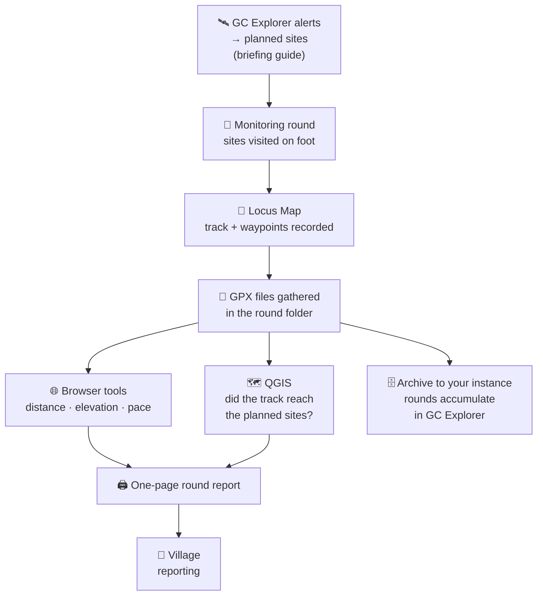

# Guide: Turning Monitoring Tracks into Round Reports

## Introduction

The [field briefing guide](/guides/land-monitoring/guide-mining-alert-field-briefings/) plans the round; the [drone guide](/guides/land-monitoring/guide-drone-photogrammetry-workflow/) closes distance without going. But when the team finally walks out with the briefing packet and comes back later, it carries something no planning document predicts: the **effort it took**. Kilometres covered, hills crossed, sites that turned out to be three river bends farther than the satellite made them look.

Right now that record usually lives in nothing but the observers' memory — information that never gets to the reports. Many teams already capture it without trying: using tools that track recording during the round. That track, processed the day the team gets home, produces two things the village council should see:

1. **The effort surfaced** — distance, days out, elevation climbed — so the council understands what monitoring actually costs, not just what it finds.
2. **The work backed up** — proof, from the device's own timestamps, of which planned sites the team physically reached and spent time at.



This guide is for the same people as the briefing guide — monitoring leads who are comfortable with QGIS and GC Explorer. Everything works with any tool that records standard GPX tracks.

## Step 1: While out — record so the track is usable later

A track is only evidence if it connects people to places. Three habits during the round make Step 4 possible:

- **One track per team per day.** Start recording in the morning, stop at the end of the day. Many short, cleanly-named files beat one three-day file: individual days can fail, be quoted, or be summed without editing anything.

Back home, export your track data, one file per day, and name for the round:

```text
2026-09_jatapu-round_teamA_day1.gpx
2026-09_jatapu-round_teamA_day2.gpx
2026-09_jatapu-round_teamB_day1.gpx
```

## Step 2: Come home — put the GPX files where the round lives

The round folder from the briefing guide, plus one new directory:

```text
2026-09_jatapu-round/
├── alerts/             # GeoJSON exported from GC Explorer (planned sites)
├── reference/          # rivers, villages
├── tracks/             # 🆕 the GPX files, one per team per day
├── round.qgz           # the QGIS project from the briefing stage
└── printed/            # briefing packet — and now, the round report
```

Do not move files out of this structure to "share them": the verification step compares tracks **against the alert exports you already made**, and both stay in the same folder. The GPX files are originals — never edit them; if a day's recording has to be trimmed, export the trim to a new file.

:::note Do this within a day of returning
GPS memory is like a notebook left open: fine until you come back and it has changed. Phones get reset, apps get cleared, SD cards get reused. The tracks are the round's only automatic witness — archive them first, report later.
:::

## Step 3: Extract the effort numbers — in the browser, nothing uploaded

For the headline numbers you do not need GIS at all. [GeoDataTools](https://geodata.tools/tools/) runs a set of GPX utilities **entirely in your browser** — the file is parsed on your own machine and never uploaded to any server, which matters when a track reveals where your observers were, or where an active site is.

| What you want | Tool | Where it shows up |
| --- | --- | --- |
| Total distance, climb, descent | [GPX Elevation Profile Viewer](https://geodata.tools/tools/elevation-profile) | Distance + elevation **gain/loss**, plus a profile chart you can screenshot for the report |
| Moving vs stopped time, pace, average & max speed | [GPX Pace & Speed Calculator](https://geodata.tools/tools/gpx-pace-calculator) | Time actually spent moving, split by pace |
| View several tracks at once, inspect a segment | [GPX Viewer](https://geodata.tools/tools/gpx-viewer), [gpx.studio](https://gpx.studio/) | Multiple team tracks overlaid; select one stretch (e.g. between two sites) and read its stats |

You can drop each day's file in, record the numbers in a simple table, and sum across teams and days:

| Day/Team | Distance | Moving time | Climb | Avg speed |
| --- | --- | --- | --- | --- |
| Team A, day 1 | 14.2 km | 5 h 10 m | 310 m | 2.7 km/h |
| Team A, day 2 | 9.8 km | 3 h 40 m | 190 m | 2.7 km/h |
| Team B, day 1 | 22.1 km | 6 h 05 m | 60 m | 3.7 km/h |

:::tip
The elevation chart from the first tool is the single best "effort" image for the council: a flat satellite route becomes a wall of climbs when printed at A4. Screenshot it once per day file; one or two go in the report.
:::

## Step 4: The one-page round report

Everything above exists to fill **one A4 page** that goes to the village council after every round — same print conventions as the briefing packet (scale bar, north arrow, minimal legend), so the council reads the before and after of the same map.

| Element | Content |
| --- | --- |
| **Header** | Round name, dates, teams and observer names |
| **The route** | Round map with team tracks over the alert sites: reached sites highlighted, unreached greyed, legend distinguishing track / site / route |
| **Effort box** | Total km · days out · elevation climbed · transport used — the numbers from Step 3 |
| **Findings table** | One row per site (below) |
| **Elevation profile** | One screenshot per day file, or the single hardest day |

The findings table is the "backing" the council signs off on:

| Site | Planned | Visited | Finding | Action proposed |
| --- | --- | --- | --- | --- |
| A3 — upper bench | ✅ | ✅ 14 Sep, 1 h 20 m | Alert confirmed: active digging, 3 machines | Incident + report to authorities |
| B1 — oxbow | ✅ | ✅ 15 Sep | No activity; alert was a cloud artifact | Close the alert |
| C2 — creek mouth | ✅ | ❌ | Not reached: falls 2 km above, season too late | Re-attempt by boat in October |

Read as a set, the page tells the council exactly what they need: *we planned against your alerts, we reached almost all of it, here is what it cost to walk those rivers, and here is what each site was actually doing.* It doubles as the appendix for funder reports — the same evidence, one level up.

:::tip
Add the verified findings back where they came from: record confirmed sites in a GC Explorer [incident](/reference/gc-toolkit/gc-explorer/incidents/). The planning map, the route that walked it, and the conclusion then live on the same record.
:::

## Step 6: Archive the tracks — let the effort accumulate

The per-round report answers "what did this round cost and find?". The year answers "what does monitoring cost *in total*?" — and only works if every round's tracks land in the same place:

- **Minimum**: the round's folder on community storage, tracks never edited or deleted, same naming.
- **Better**: Use the Guardian Connector [dataset importer](/reference/gc-toolkit/gc-scripts-hub/dataset-importer/) to upload your tracks and waypoints to your warehouse, so that you can show them in [GC Explorer](/reference/gc-toolkit/gc-explorer/) alongside the alerts.

Once rounds accumulate as data instead of files, a dashboad can be created to gather the cumulative report.

## Related documentation

- [Preparing Mining Alert Field Briefings](/guides/land-monitoring/guide-mining-alert-field-briefings/) — this guide's predecessor: the planned sites and the folder this one fills
- [From Mining Alerts to Drone Maps](/guides/land-monitoring/guide-drone-photogrammetry-workflow/) — the other way to cover distance when the round cannot
- [Use your data in QGIS](/reference/common-workflows/use-your-data-in-qgis/) — getting exports into the project
- [Incidents in GC Explorer](/reference/gc-toolkit/gc-explorer/incidents/) — record findings where the alerts live

## 📚 Further reading

- [GeoDataTools — browser-based GPX tools](https://geodata.tools/tools/) — elevation profile, pace & speed, viewers and converters, all client-side
- [gpx.studio](https://gpx.studio/) — open-source, in-browser GPX editor: view, trim, merge tracks
- [QGIS Documentation](https://docs.qgis.org/)
- [Locus Map](https://www.locusmap.app/) — track recording and GPX export
