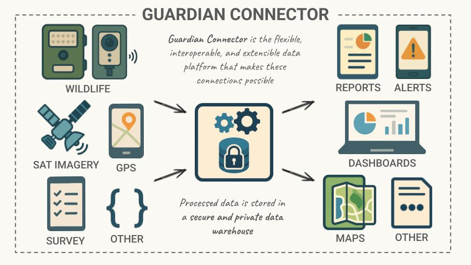

# About Guardian Connector

Guardian Connector is a free and open-source **Indigenous data sovereignty platform for communities** to securely centralize, access, and derive insights from their environmental and cultural data. Developed through collaboration between Indigenous communities, Conservation Metrics, and technical partners, Guardian Connector addresses the unique challenges faced by communities on the frontlines of protecting their territories.

## Why Guardian Connector Exists

Digital technology can play a vital role in helping people gather the information they need to make better decisions about community well-being and ecosystem health. Yet many off-the-shelf solutions fall short for Indigenous and local communities, who protect over 80% of the world’s biodiversity and more than 35% of intact forest landscapes. These tools are often overly complex, built around Western data frameworks, dependent on external servers, and difficult to use in remote or low-connectivity environments. Just as critical, little attention is paid to where the data resides once collected, leaving communities without true ownership or control.

As highlighted in the UN Human Rights Council’s Expert Mechanism on the Rights of Indigenous Peoples [Study on the Right of Indigenous Peoples to data, including with regard to data collection and disaggregation](https://digitallibrary.un.org/record/4087217?v=pdf):

> Indigenous Peoples remain largely excluded from the collection, use and application of data about them, their lands and their cultures. Existing data and data infrastructure fail to recognize Indigenous knowledge and world views and do not meet Indigenous Peoples’ current and future data needs.

Guardian Connector is being built with Indigenous partners to help close this gap, guided by the principles of Indigenous Data Sovereignty (IDSov).

### What Guardian Connector Offers

🛡️ **Data Sovereignty**: Complete ownership and control over community data

📊 **Biocultural Metrics**: Access to indicators that reflect Indigenous perspectives on well-being

🔗 **Multi-tool Integration**: Easy use of datasets from multiple monitoring and data collection tools

⚡ **Real-time Alerts**: Near real-time notifications about territorial incursions and environmental changes

🏠 **On-premises Storage**: Data stored on infrastructure that communities own entirely

♻️ **Long-term Sustainability**: A platform designed to serve communities independently without dependency on outside support

## How Guardian Connector Works

Guardian Connector serves as a bridge between diverse data sources — from mapping and remote sensing to wildlife monitoring and surveys — and the outputs communities need, such as maps, dashboards, alerts, and reports. By transforming and storing information in a secure warehouse, the platform ensures that communities can explore, share, and act on their data with confidence.

_A diagram of the Guardian Connector system_

## Who is Building Guardian Connector

Guardian Connector is being co-created by [Conservation Metrics, Inc.](https://conservationmetrics.com/) in close partnership with (and with funding from) [Nia Tero](https://niatero.org/), and a number of Indigenous partner organizations.