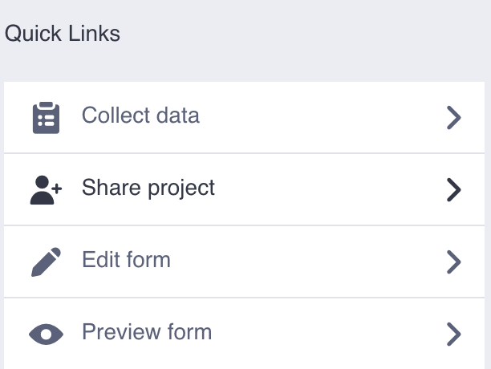

# From KoboToolbox to Guardian Connector

If you are using KoboToolbox, then you may eventually want to preserve your data in your data warehouse.

Follow these steps to save KoboToolbox data in your Guardian Connector instance on a schedule.

Once scheduled to be downloaded, KoboToolbox form data will be saved regularly. Once in the data warehouse, you can use or analyze the data with other tools.

## Step 1: Add a Guardian Connector account to your KoboToolbox project

To do so, you will need to navigate to your Project's Summary page, and select the "Share project" quick link.

Once in the Share project screen, you will have to add the username used by your Guardian Connector instance to collect the data (if in doubt, ask your Guardian Connector Administrator).

Make sure you give the right permissions to the user. In this case would be "Manage project".

## Step 2: Send the relevant information to your Guardian Connector Administrator

You will need to send two things:
- The KoboToolbox instance your project is registered: can be kf.kobotoolbox.org or kc.kobotoolbox.org
- The Project ID

You can find the Project ID in the URL of your KoboToolbox project's Summary page.

If the URL looks like this: https://kf.kobotoolbox.org/#/forms/a26w95BYpDoxBJbxDAaSbH/summary

The Project ID would be in between "forms/" and "/summary". In this case it would be: a26w95BYpDoxBJbxDAaSbH

## Step 3: The Guardian Connector Administrator will set up the schedule to download the form data regularly

Using the information provided, the Guardian Connector Administrator will schedule a new script run to be executed regularly. This will download the data from KoboToolbox and store it into a database table, making it available for the different tools in the toolkit such as [Superset](../../gc-toolkit/superset/) and [Explorer](../../gc-toolkit/gc-explorer/).

