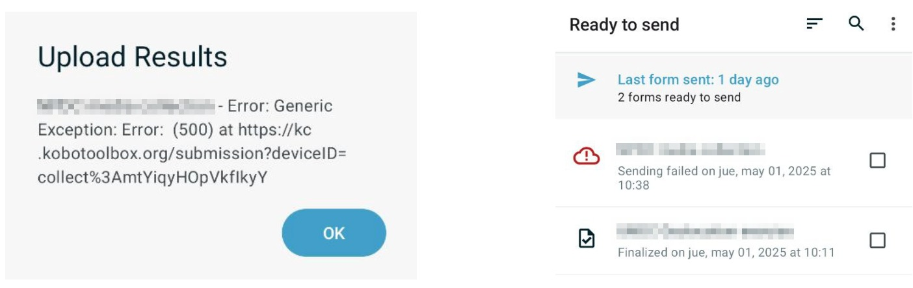
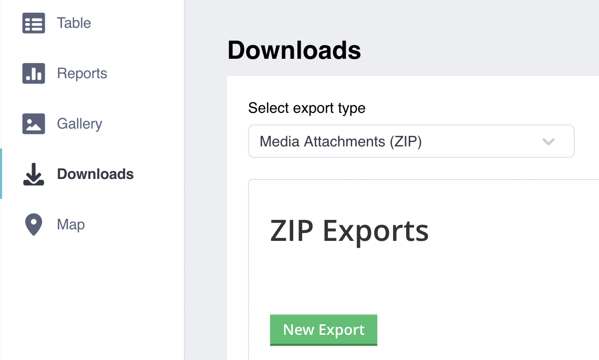
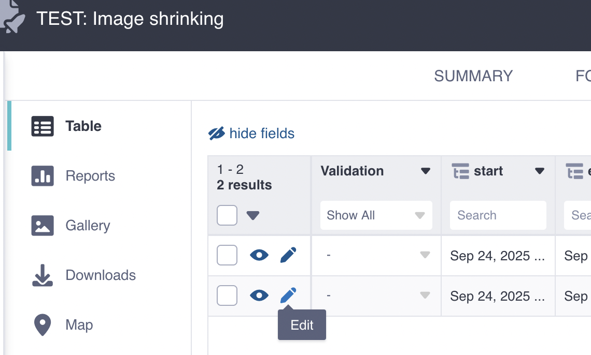

# Troubleshooting Guide

## How to manually send or retrieve a failed submission from KoboCollect

When a submission from the phone fails, you'll need to troubleshoot the unsent survey and potentially submit it manually through an alternative method.

_Submissions fail when the alert shown above appears on screen after attempting to submit a finalized submission._

The failed submission will then appear on the "Ready to send" screen with a red cloud containing an exclamation mark, indicating there was an issue sending this form.

**To manually send a failed submission, you will need:**

1. A computer
2. The phone/tablet where the failed survey is stored
3. A USB data cable compatible with your phone 
4. The following identifiers:
    - `Project_hash`: This is your user folder inside KoboToolbox. If you have multiple projects set up, you will have several folders. There's no way to identify them from the folder names alone, so you'll need to browse inside each folder to determine which one contains your project.
    - `Survey_id`: This is the survey name combined with the date and time when the survey was completed

**Follow these steps to retrieve and send the failed submission:**

1. Connect the phone to the computer using the USB cable
2. A pop-up should appear on your phone's screen asking what type of connection you want. Select "File Transfer"
3. On your computer, open the file manager, access the phone's storage, and navigate through the folders in this order: `Internal Storage -> Android -> data -> org.koboc.collect.android -> files -> projects -> <project_hash> -> instances -> <survey_id>` (the survey_id folder will include a timestamp)
4. Copy the survey folder to your desktop
5. Right-click on the folder and select "Compress" or "Create archive." A file with a `.zip` extension will be created
6. Send this ZIP file through your agreed communication channel

:::info

If the pop-up in step 2 does not appear, or if your phone cannot connect to the computer for any reason, you can still retrieve project data from your phone using alternative methods. However, this process requires someone with technical experience who is comfortable using the command line and a tool called `adb` (Android Debug Bridge).

:::

## Shrink images from a KoboToolbox Project

It is quite frequent that if the project involves images as attachments, that users of a free Kobo Toolbox account might run into storage limits. And when that happens, it is difficult to address. One way about it is to shrink the images that are attached to each of the submissions and re-upload the images in their minimized size.

That way you can reduce the weight of a Kobo Toolbox. significantly.

To reduce the size of images in your KoboToolbox project, follow these steps:

1. Open your project in KoboToolbox
2. Navigate to the "Data" section, and then "Downloads"
3. Select the export type "Media Attachments (ZIP)"

4. Download the images as a ZIP file
4. Shrink all images with any local tool, like ImageMagik or Pillow, o in Windows you can use the [Microsoft PowerTool's Image Resizer](https://learn.microsoft.com/en-us/windows/powertoys/image-resizer).
5. Edit each of the form submissions and reupload the shrinked image, making sure you upload the image that matches the name of the already uploaded.
.
