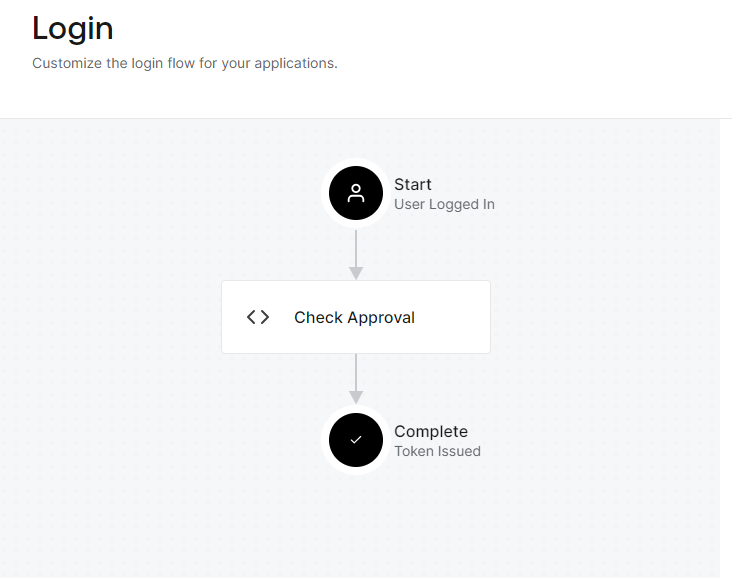

# Auth0

[Auth0](https://auth0.com/) is an identity and access management platform that provides authentication and authorization services for Guardian Connector deployments.

## How Auth0 is used in Guardian Connector

Auth0 enables secure user authentication and access control across Guardian Connector tools:

- **Single Sign-On (SSO)** - Users authenticate once to access multiple Guardian Connector services
- **User management** - Centralized user registration, login, and profile management
- **Role-based access control** - Different permission levels for administrators and community members

## Getting Started

1. Create an Auth0 account at [auth0.com](https://auth0.com/)
2. Configure applications for each Guardian Connector service
3. Set up user roles and permissions based on your community's needs
4. Configure Auth0 credentials in your Guardian Connector environment variables
5. Test SSO flow across your Guardian Connector tools

For detailed setup and configuration, see the [Auth0 documentation](https://auth0.com/docs/).

## User Approval Process

1. User signs up for Guardian Connector applications (Superset, GC Scripts Hub,GC Explorer, etc.) using Auth0 — either by creating an account or using a service like Google or GitHub.
2. Upon signup, the user will see a message like "Invalid login" on Superset, or "Your approval is pending" on GC Explorer, etc.
3. An Auth0 tenant administrator approves the user by adding `"approved": true` to the user's App Metadata JSON. This can be found by navigating to User Management > Users, clicking on the user to approve, and scrolling down to the app_metadata section.
4. The user can now authenticate and log in to Guardian Connector applications.

## Configuring an Auth0 Tenant

An Auth0 tenant is a dedicated instance of the Auth0 identity management platform that belongs to a specific organization or application. It acts as a container for all configurations, user data, and security settings related to your identity management needs. Each tenant operates independently, ensuring that the configurations and data within it are isolated from other tenants. This setup allows organizations to manage user authentication, authorization, and security policies centrally for their applications.

Follow these steps to set it up for your instance:

1. In **Settings**, select "Production" as the Environment Tag.
2. In **Actions**, set up a Flow for user approval.
3. In **Branding**, make any customizations such as adding a logo and setting the background color.
4. In **Authentication / Database**, ensure Sign Ups are enabled (they are by default).
5. In **Authentication / Social**, enable `google-oauth2`. Configure a Client ID and Client Secret for an OAuth 2.0 Client from a Google Cloud Platform project. See [this section on `gc-deploy` for more information](https://github.com/ConservationMetrics/gc-deploy/tree/main/auth0#gcp-oauth-client-configuration).

## Creating an Auth0 Flow Action for User Approval

To handle user approval in Auth0, a Flow Action (named "Check Approval") serves as middleware between logging in and token issuance.



This is the code for that Action, based on the [Common Use Cases in the Auth0 documentation](https://auth0.com/docs/customize/actions/flows-and-triggers/login-flow#common-use-cases):

```javascript
exports.onExecutePostLogin = async (event, api) => {
  // Check if the user is approved
  if (event.user.app_metadata && event.user.app_metadata.approved) {
    // User is approved, continue without action
  } else {
    api.access.deny('Your approval to access the app is pending.');
  }
};
```

The Action checks if the boolean property `user.app_metadata.approved` is true and allows the user to proceed. Otherwise, it returns the message "Your approval to access the app is pending", which is also passed as a query parameter in the browser and used by applications like GC Explorer to indicate to the user that they need approval.