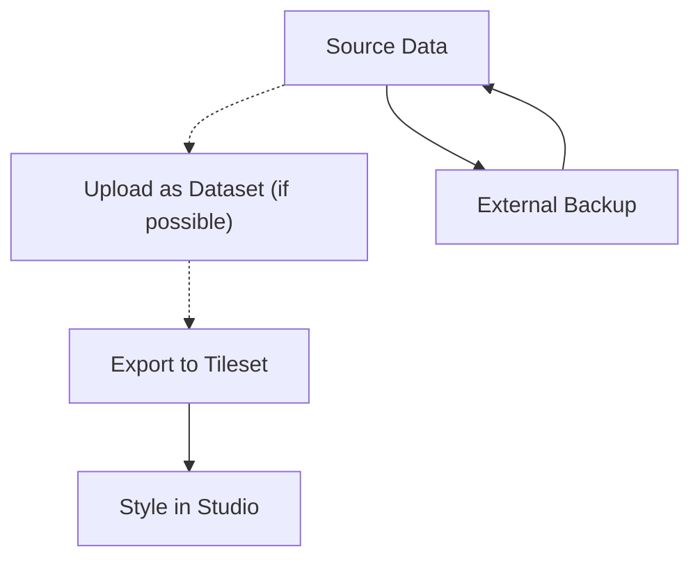

# Mapbox

[Mapbox](https://www.mapbox.com/) is a mapping platform that provides the foundation for interactive maps across Guardian Connector instances.

## How Mapbox is used in Guardian Connector

Mapbox serves three primary purposes in Guardian Connector deployments:

- **Access tokens for basic maps** - Shared across GC instances to provide base map layers and standard mapping functionality for tools like [Superset](/reference/gc-toolkit/superset/)
- **Custom map styles** - Created in Mapbox Studio for specific maps or alerts dashboards in [GC Explorer](/reference/gc-toolkit/gc-explorer/)
- **Offline maps** - Mapbox styles can be compiled into offline map packages for use in [CoMapeo](/reference/connected-applications/comapeo/) using tools like [QGIS](https://www.qgis.org/) and [MapPacker](https://github.com/conservationmetrics/mappacker)

## Understanding Mapbox Data Architecture

Mapbox organizes geospatial data through three core components that work together to deliver interactive maps:

### Datasets
**Datasets** are editable collections of GeoJSON features stored in Mapbox. These represent the raw geospatial data and can be modified feature-by-feature using the Mapbox Studio dataset editor or Datasets API.

- **Use case**: Initial data storage and ongoing edits
- **Format**: GeoJSON FeatureCollection
- **Editability**: Fully editable (add, modify, delete features and properties)
- **Size limits**: No storage limit, but Studio editor displays only datasets ≤20MB

### Tilesets
**Tilesets** are optimized, pre-processed collections of geospatial data broken into a uniform grid of tiles at multiple zoom levels (up to zoom 22). Datasets must be exported to tilesets before use in map styles. It is possible to generate tilesets directly without using datasets, for example by dragging and dropping spatial data directly into the Mapbox Studio style editor.

- **Use case**: Optimized map rendering and styling
- **Format**: Vector tiles (MVT) or raster tiles
- **Editability**: Read-only once processed
- **Performance**: Highly cached and optimized for fast loading

### Styles
**Styles** define the visual appearance of maps using the [Mapbox Style Specification](https://docs.mapbox.com/style-spec/). They reference tilesets as data sources and apply styling rules to create the final map appearance.

- **Format**: JSON document (style.json)
- **Components**: Data sources, layers, styling properties, fonts, and sprites
- **Editability**: Can be modified in Mapbox Studio or programmatically

## Account-Based Data Management

All Mapbox data (datasets, tilesets, styles) are tied to specific Mapbox accounts, creating important management considerations:

- **Account ownership**: Data cannot be transferred between accounts without explicit export/import processes
- **Billing dependencies**: Unpaid accounts may lose access to data and disable map functionality
- **Access control**: Private styles and tilesets are only accessible with valid access tokens from the owning account

### Account Setup Considerations

**Organizational naming**: When setting up Mapbox accounts for Guardian Connector instances, use organizational names like `OrganizationName-GC` rather than personal names. This is critical because account IDs cannot be changed after creation, and access tokens are non-transferable between accounts.

**Multi-client deployments**: For organizations managing multiple Guardian Connector instances for different clients, set up unique Mapbox accounts for each client. This 1:1 setup enables:
- Clients to assume future ownership of their account
- Independent access to usage statistics for their projects  
- Direct billing management
- Each client to receive their own free tier of API calls

:::tip 

Mapbox allows for plussed aliases (such as `your-email+mapbox-1@example.com`, `your-email+mapbox-2@example.com`, etc.) for account names. This is a good practice to make it easier to manage accounts.

:::

For comprehensive guidance on account setup and collaboration, see [Mapbox collaboration best practices](https://docs.mapbox.com/help/troubleshooting/collaboration-best-practices/).

### Data Portability Limitations

**Styles**
- **Public styles**: Can be copied by other users via share links
- **Private styles**: Must be downloaded as JSON and manually re-uploaded to new accounts
- **Custom assets**: Fonts and icons require separate transfer

**Tilesets**
- **Public tilesets**: Can be referenced by other accounts but not truly transferred
- **Private tilesets**: Cannot be directly copied; require re-upload of source data
- **Data loss risk**: If source data is lost, tilesets cannot be reconstructed

## Data Upload and Preservation Strategies

Mapbox offers multiple ways to add data to your account, each with different implications for data preservation:

**Direct upload to style editor**:
- **Process**: Drag and drop spatial data directly into Mapbox Studio style editor
- **Result**: Data immediately converted to tilesets without intermediate datasets
- **Risk**: Original source data is not preserved and cannot be recovered

**Dataset-first approach (recommended)**:
- **Process**: Upload data as dataset → edit if needed → export to tileset → style in Studio
- **Result**: Preserves both raw data (dataset) and optimized data (tileset)
- **Benefits**: Data remains editable and recoverable

### Recommended Workflow

**Best practices for data preservation**:
1. **Always maintain external backups** of source data in version control or cloud storage
2. **Upload as datasets first** if possible, to preserve editability and source data
3. **Document data sources** and processing workflows
4. **Export to tilesets** only when data is finalized for styling
5. **Version control style JSON** files when possible

## Getting Started

1. Create a Mapbox account at [mapbox.com](https://www.mapbox.com/)
2. Generate an access token for your Guardian Connector deployment
3. Configure the access token in your GC Explorer and Superset environment variables
4. Optionally create custom map styles in Mapbox Studio for specific views and dashboards

:::warning Security Best Practice

Always restrict your Mapbox access token to specific URLs and referrers to prevent unauthorized usage. Configure URL restrictions in your Mapbox account settings.

## Related Documentation

- [Mapbox Studio Manual](https://docs.mapbox.com/studio-manual/) - Comprehensive guide to data management and styling
- [Mapbox Style Specification](https://docs.mapbox.com/style-spec/) - Technical specification for map styles
- [Mapbox Account Management](https://docs.mapbox.com/accounts/guides/) - Account settings and security configuration
- [Data Upload Troubleshooting](https://docs.mapbox.com/help/troubleshooting/uploads/) - Common upload issues and solutions