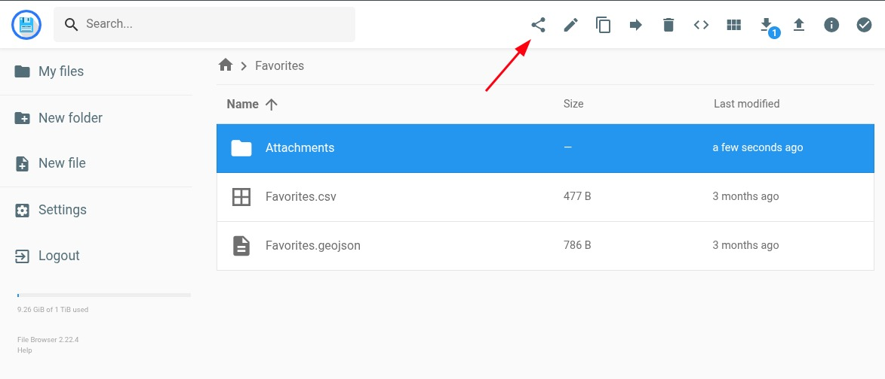
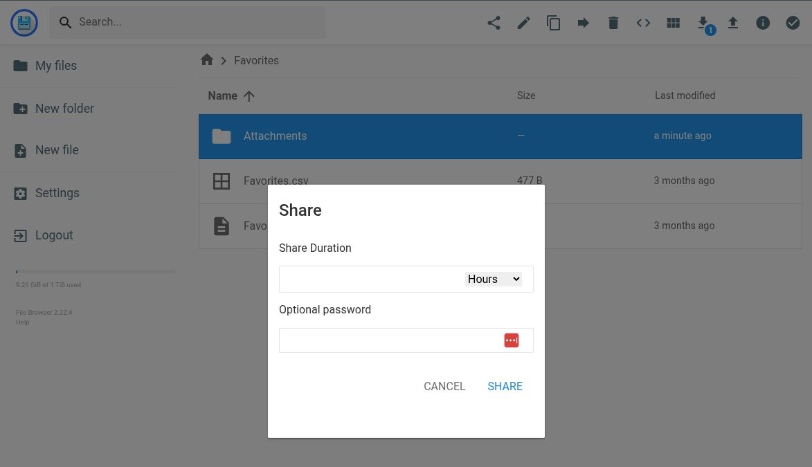
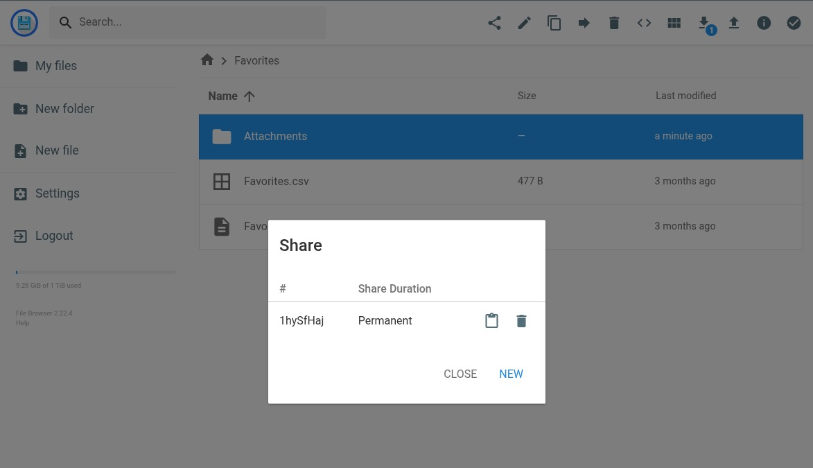

# Filebrowser

[Filebrowser](https://filebrowser.org/) is a web-based file manager that allows users to browse, upload, download, and share files from their Guardian Connector instance.

## How Filebrowser is used in Guardian Connector

Filebrowser provides essential file management capabilities for Guardian Connector deployments:

- **File upload and download** - Users can easily upload files to their Guardian Connector instance and download stored resources
- **Share link generation** - Create shareable links for files, enabling embedding of resources like images on web pages, and the views of [GC Explorer](/reference/gc-toolkit/gc-explorer/).

### Generating Share Links

1. With a file or directory selected, click the "Share" icon.

   

2. In the modal that appears, click "Share". (Note: by not filling in any share duration, the link will be valid indefinitely.)

   

3. The modal will provide you with a share "hash" and a link to copy for your file / directory. The link will be in the format `https://files.<community_slug>.guardianconnector.net/share/<hash>`.

   

4. You can now share the link with others to allow them to access the file or directory.

:::tip
To use the share link for a GC Explorer view where you want to embed media (like images or audio), you need to format the link somewhat differently. 

Instead of the share link as shown above, use the following format: `https://files.<community_slug>.guardianconnector.net/api/public/dl/<hash>`
:::

## Documentation

For detailed information about using Filebrowser, visit the [official Filebrowser documentation](https://filebrowser.org/index.html).

:::note
Filebrowser is currently in maintenance mode. We are monitoring the future of this tool, and may decide to use an alternative tool if Filebrowser development and maintenance stagnates.
:::