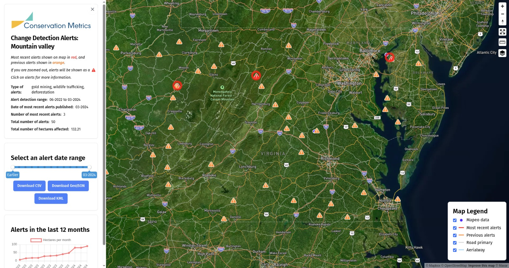

# GC Explorer

The [Guardian Connector Explorer (GC Explorer)](https://github.com/conservationmetrics/gc-explorer) is a web-based data visualization tool that transforms your community's tabular data into interactive maps, galleries, and dashboards. Built specifically for Guardian Connector, it connects directly to your PostgreSQL database to display data collected from tools like CoMapeo, KoboToolbox, and other data collection platforms.

## 🗺️ Available Views

**📍 Map View**: Visualize your geospatial data on an interactive map with pop-up information panels and embedded media attachments.

**📸 Gallery View**: Browse through photo, audio, and video content collected in the field, organized by date or location.

**⚠️ Alerts Dashboard**: Monitor environmental changes and threats with change detection alerts and before-and-after satellite imagery.

## 🔄 Data Integration

GC Explorer automatically works with data from:
- **CoMapeo**: Community mapping and observation data
- **KoboToolbox/ODK**: Survey responses and forms  
- **Environmental Alerts**: Satellite change detection data
- **Custom Data Sources**: Any PostgreSQL-compatible tabular data

_Example of an Alerts Dashboard in GC Explorer_

GC Explorer transforms raw data into accessible, visual formats that help communities understand, share, and act on their collected information.