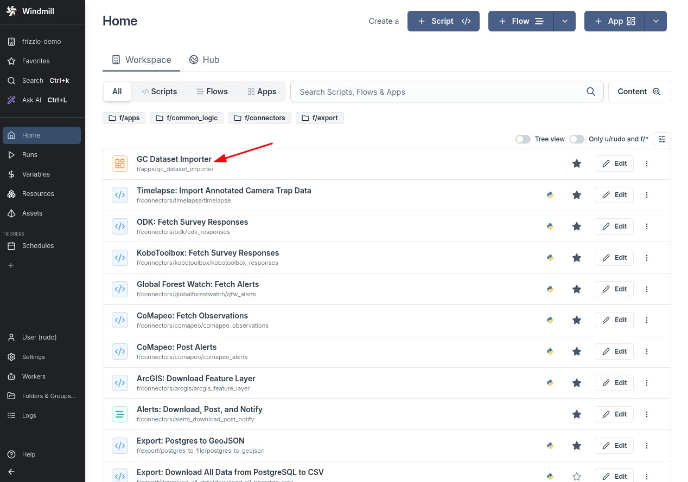
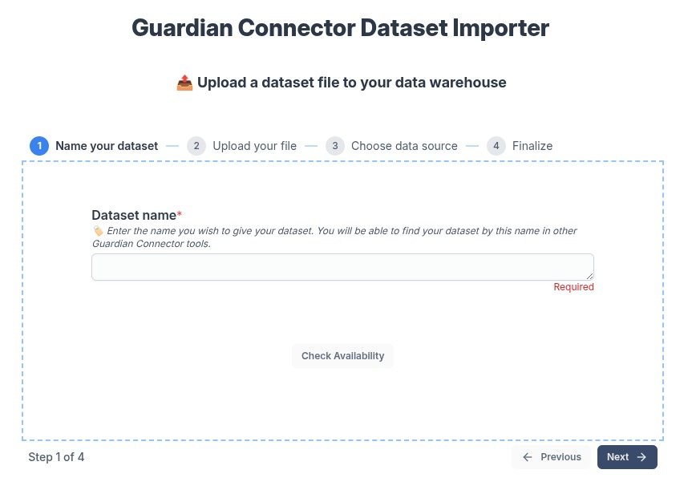
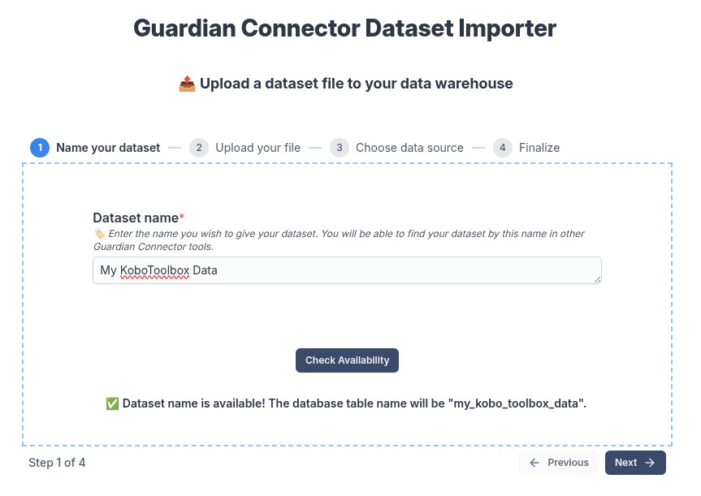
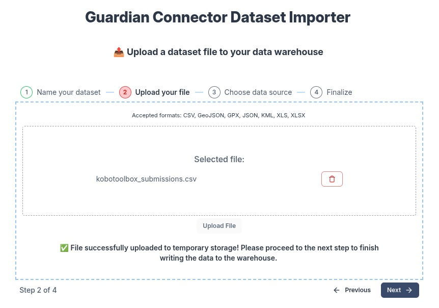
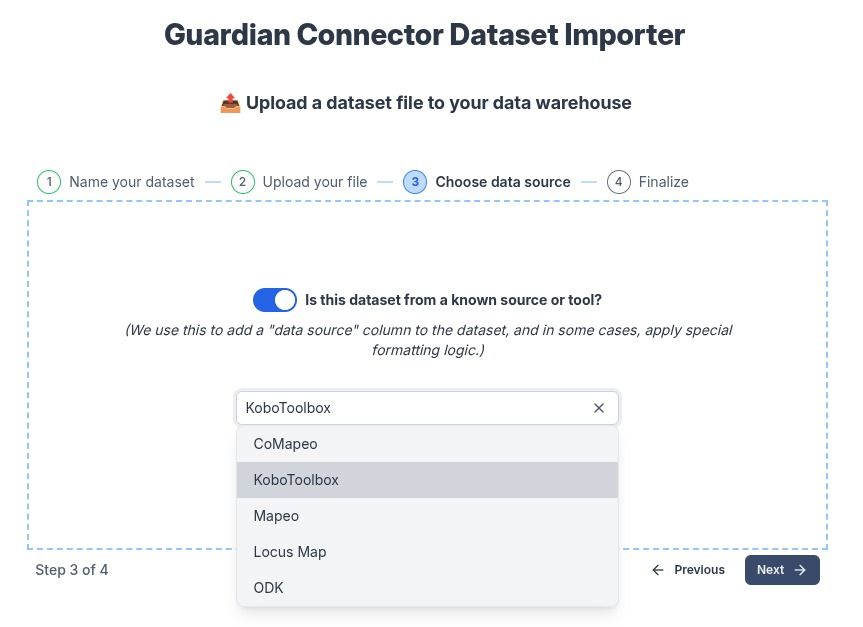
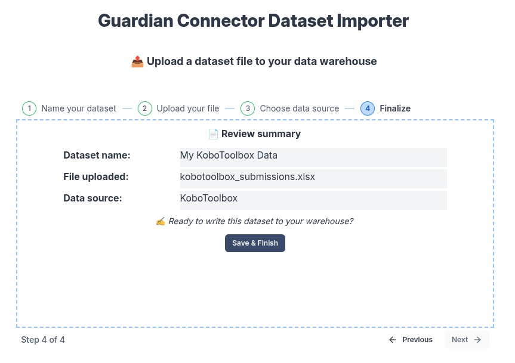
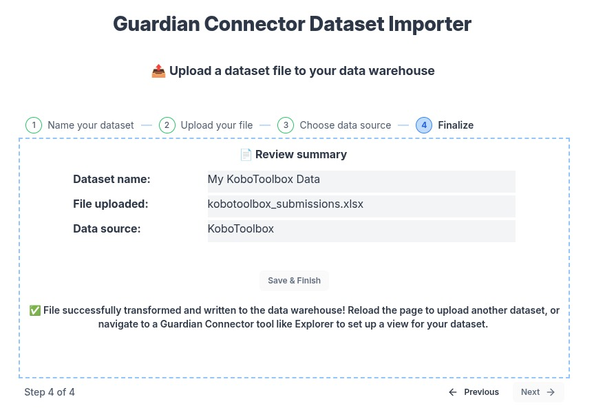
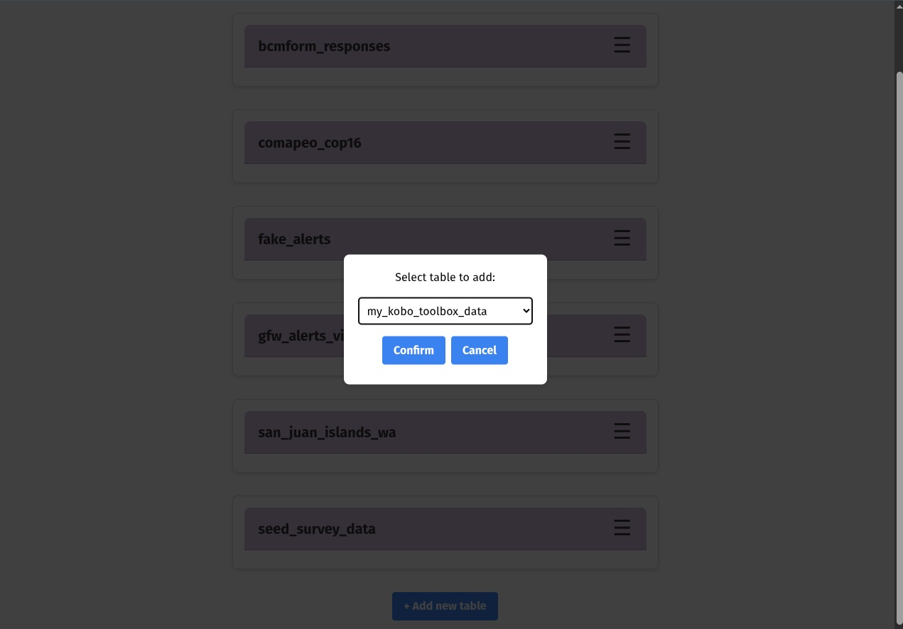
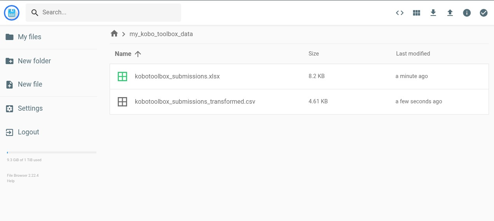

# GC Dataset Importer

Upload a dataset file and turn it into a clean PostgreSQL table in your Guardian Connector data warehouse. The app guides you through naming the dataset, uploading a file, optionally tagging the **data source**, and finalizing the import. It also saves the original and transformed files to your deployment’s data lake (accessible via [Filebrowser](/reference/gc-toolkit/filebrowser/)).

---

## 📦 What this tool does

* Converts and validates common **tabular** files (`.csv`, `.xlsx/.xls`, `.json`) to CSV for ingestion
* Converts and validates common **spatial** files (`.geojson`, `.kml`, `.gpx`, `.kmz`) to GeoJSON for ingestion
* Optionally applies **source-specific** transformations (e.g., KoboToolbox, CoMapeo, ODK, Locus Map)
* Writes the result to a **new** Postgres table and archives files to file storage

---

## Step-by-Step: Import a Dataset

### 1. Open the app in Windmill

From **GC Scripts Hub → Apps**, click **GC Dataset Importer**.

### 2. Name your dataset

Give your dataset a clear, human-readable name, then click **Check Availability**.

If available, you’ll see the resulting table name you’ll get in the warehouse.

### 3. Upload your file

Select your file and click **Upload File**. When the upload completes, proceed to the next step.

**Accepted formats**: CSV, GeoJSON, GPX, JSON, KML, XLS, XLSX, KMZ, XML (SMART)
(Shapefiles are not yet supported.)

### 4. (Optional) Choose a known data source

If the file originates from a known tool, toggle **Is this dataset from a known source or tool?** and select it. This adds a `data_source` tag and, for some sources, applies smart formatting.

**Examples**

* **KoboToolbox**: standardizes survey exports for consistent column names and types
* **CoMapeo / Mapeo / Locus Map**: normalizes fields for observations and waypoints

### 5. Review and finalize

Confirm the summary and click **Save & Finish** to write the data.

You’ll see a success message when the import is complete.

---

## After You Import

### Use your new table in GC Explorer

Open **GC Explorer** and add your newly created table to a View to explore or publish.

See: [GC Explorer](/reference/gc-toolkit/gc-explorer/)

:::info

If you are using [Superset](/reference/gc-toolkit/superset/), or any other tool that uses PostgreSQL as a data source, you can use also access the uploaded data there.

:::

### Access your uploaded files in Filebrowser

The importer saves both the **original** file and any **transformed** output in a folder named after your table (e.g., `my_kobo_toolbox_data`).

See: [Filebrowser](/reference/gc-toolkit/filebrowser/) for share links or downloads.

:::tip

If you uploaded a spatial data file, you can download it here to use in a tool like [QGIS](/reference/recommended-applications/qgis/).

:::

---

## Tips & Troubleshooting

* **“⚠️ Dataset name is already in usage.”** Pick a different dataset name. The table name must be unique in the warehouse.
* **Unsupported file type.** Convert it locally to one of the supported formats, then re-upload.
* **Large files.** If the upload stalls, the file might be too large. Try resizing the file to a smaller size. A recommended maximum size for a file is 5MB on a computer, or 1-2MB on a mobile device.
* **Accidental upload.** If you accidentally upload a file, but did not click **Save & Finish**, you can just refresh the page. (It will be cleaned up automatically.) If you did click **Save & Finish**, the database table will have to be deleted manually. (In the future, we will add a way to delete the table.)

_For any other issues, please contact us at [guardianconnector@conservationmetrics.com](mailto:guardianconnector@conservationmetrics.com) or file an issue on [GitHub](https://github.com/ConservationMetrics/gc-scripts-hub/issues)._

---

## See also

* [**Technical overview & architecture**](https://github.com/ConservationMetrics/gc-scripts-hub/blob/main/f/apps/gc_dataset_importer.app/README.md) - for developers, and includes a [to-do list](https://github.com/ConservationMetrics/gc-scripts-hub/blob/main/f/apps/gc_dataset_importer.app/README.md#todo) for future features.