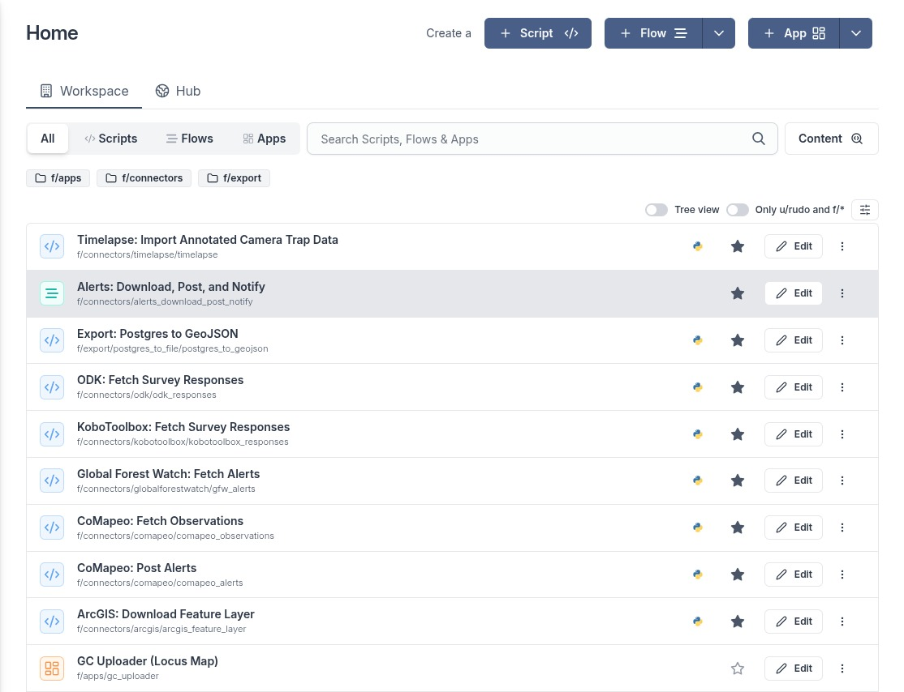

# GC Scripts Hub

The [Guardian Connector (GC) Scripts Hub](https://github.com/conservationmetrics/gc-scripts-hub) is a growing collection of automation scripts designed to help communities guard and manage their land through data integration and workflow automation. Built on the [Windmill](https://www.windmill.dev/) platform, these scripts empower communities to connect different tools, automate data collection, and streamline their conservation workflows without requiring deep technical expertise.

## 🔗 Data Connectors

The GC Scripts Hub includes connectors that automatically gather data from various platforms and tools commonly used by communities:

### 📋 Survey & Data Collection
- **[KoboToolbox](/reference/integrated-tools/kobotoolbox/index.md)**: Fetch survey responses and form data, including support for multilingual forms and media attachments
- **ODK Central**: Fetch survey responses and form data from ODK Central, including media attachments

### 🌍 Environmental Monitoring
- **Global Forest Watch**: Download deforestation alerts, fire alerts, and other environmental change detection data for your territory
- **Google Cloud Alerts**: Retrieve change detection alerts and satellite imagery showing before-and-after comparisons

### 🗺️ Mapping & Location
- **[CoMapeo](/reference/integrated-tools/comapeo/index.md)**: Import community mapping data and observations, with support for photos and other attachments
- **ArcGIS**: Download data from ArcGIS Online, including from tools such as Survey123
- **Locus Map**: Import GPS tracks and mapping data

## 📤 Data Export & Sharing

### 🔄 Alert Distribution
- **WhatsApp Notifications**: Automatically send alert summaries to community members via Twilio
- **CoMapeo Integration**: Post environmental alerts directly to CoMapeo servers for offline access

### 📦 Data Sovereignty
- **Complete Data Export**: Download all your community's data as CSV files, supporting data sovereignty and exit plans
- **Flexible Formats**: Export data in formats suitable for different analysis tools and platforms

## 🤖 Automation Capabilities

These scripts can be scheduled to run automatically, creating workflows such as:
- Regular checks for new deforestation alerts in your territory
- Hourly exports of survey data for community meetings  
- Immediate WhatsApp notifications when environmental threats are detected

## 🌱 Community-Focused Design

The Scripts Hub recognizes that every community has unique needs and workflows. Scripts can be customized and combined to create automated processes that support your specific conservation goals, whether that's monitoring biodiversity, documenting cultural sites, or tracking environmental threats.

This resource continues to grow based on community needs and feedback, ensuring that the tools evolve to better serve grassroots conservation efforts worldwide. 

_A Windmill Workspace populated with some of the tools in the GC Scripts Hub._

