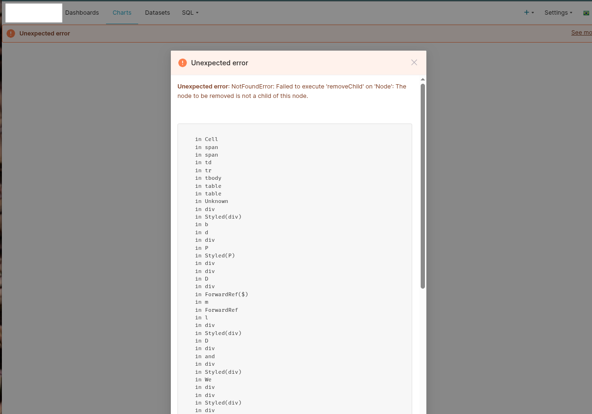

# Troubleshooting Guide

## Compatibility with Browser Translation services

Superset doesn't get along well with the Google Chrome translation services that come built-in with the browser. 
The downside is that the translation services are usually enabled automatically or inadvertently by the user when the user accepts the page to be translated. Or even though the user has not requested that, the browser might automatically attempt to translate the page.

One way that this issue comes up is if you see the following error while trying to save a chart:

The workaround for the issues that this brings is to disable the translation services within Google Chrome and use the built-in translations from Superset for the tool.

You do it by selecting the "Never Translate This Site" option from the translate button on the right of the navigation bar within Google Chrome.

Later you can select your language of choice in Superset with the selector on the top right corner.