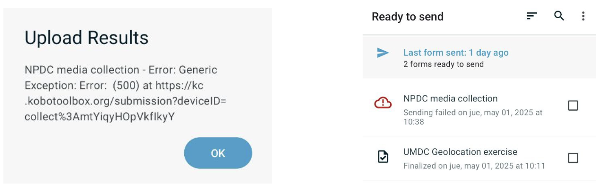

# KoboToolbox Troubleshooting Guide

## Kobo Collect failed submission

In the case that a submission from the phone fails, there will be a need to troubleshoot the unsent survey, and potentially aggregate it to the submissions via an alternative method.

Submissions fail when the following alert appears on screen after attempting to submit a finalized submission.

From there on, the failed submission will appear on the "Ready to send" screen (above) with a red cloud with an exclamation mark inside, flagging that there was an issue sending this form.

To send a failed submission you will need:
1. A computer
2. The phone/tablet where the failed survey is
3. A USB Data cable compatible with your phone 
4. Some data:
    - `Project_hash`: it is your user inside Kobo. If you have more than one set up, you will have many folders in there. There is no way to identify them from outside, so you will have to browse inside the folders to figure out which one of them is the proper one.
    - `Survey_id`: it is the survey name and date and time of the survey

With all this, here are the steps required:
1. Connect the phone to the cable, and the other end of the cable to the computer
2. A pop-up should appear on your phone’s screen, prompting you to choose what you want to connect the phone for. Select “File Transfer”.
3. In your computer, open the File Manager, access the phone’s storage and follow the folders in this order: `Internal Storage -> Android -> data -> org.koboc.collect.android -> files -> projects -> <project_hash> -> instances -> <survey_id>` (which has a timestamp)
4. Copy the folder to the Desktop
5. Compress the folder by right clicking on it and selecting compress. A file with `.zip` extension will appear.
6. Send this file over the agreed channel.

If the pop-up in step 2 does not appear, or your phone cannot connect to the computer for any reason, you can still retrieve project data from your phone using alternative methods. However, this process requires someone with technical experience who is comfortable using the command line and a tool called `adb` (Android Debug Bridge).
