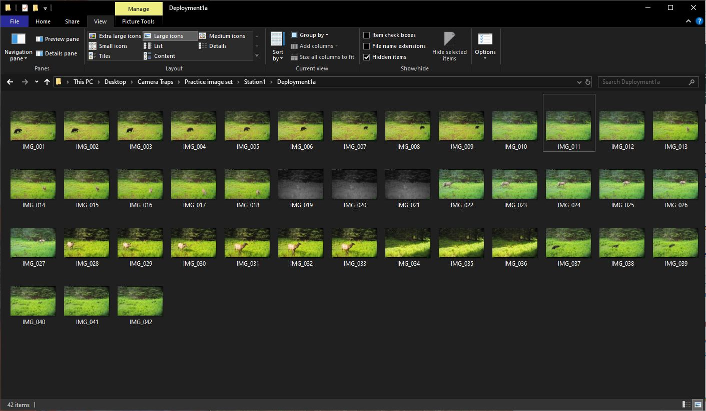

# Step 1: Organizing Imagery

It’s important that images are carefully organized. All images that are to be analyzed together, or your "image dataset", should have the same root folder and can be separated into sub-folders under the root. Below is a suggested folder structure, however it may vary depending on the setup of your project’s deployments and retrievals.

```
ProjectName/
├── Springfield/
│ ├── Deployment_20240319/
│ │ ├── Camera1/
│ │ └── Camera2/
│ ├── Deployment_20240425/
│ │ ├── Camera1/
│ │ └── Camera2/
├── Fairfax/
│ ├── Deployment_20240512/
│ │ ├── Camera1/
...
```

In this example, a new retrieval folder is created for each camera check. The retrieval folders serve as the root folders for your image dataset. All photos from an SD card should be placed at the lowest folder level. For instance, photos from an SD card pulled from Camera 1 on March 19, 2024, would be copied into `Springfield/Deployment_20240319/Camera1`. This structure makes it easier to organize new imagery as additional retrievals are added.


_Example of a Timelapse project folder structure, using the practice image set._

:::important

Once you begin analysis in Timelapse, do not rename, move, or reorganize any folders or files within the root folder. You _can_ move or copy the root folder itself.

:::
