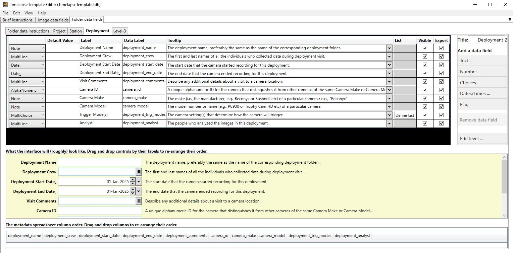

# Step 3: Setting Up Folder-Level Metadata

:::note

Please see the [Timelapse Metadata Guide](https://timelapse.ucalgary.ca/wp-content/uploads/Guides/TimelapseMetadataGuide.pdf) for the most recent and accurate information

:::

Timelapse supports folder-level metadata, which allows you to associate project, station, or deployment information with entire folders of images. This helps avoid repetitive data entry and ensures consistency across related image files.

_Example of Timelapse project folder-level metadata, using the practice image set._

:::tip
Before enabling folder-level metadata, think through your folder hierarchy and naming conventions. Changes later can break links between data and folders, so it’s best to finalize your structure first.
:::

## How to set up Folder metadata

1. **Structure your folders** to reflect your metadata hierarchy. See [Step 1: Organizing Imagery](step-1-organizing-imagery.md)

2. **Start the Timelapse Template Editor** software. (This is the `TimelapseTemplateEditor.exe` file in your Timelapse directory.)

3. **Define folder-level metadata fields** in the Template Editor. You can create multiple levels (such as Project, Station, and Deployment) and assign specific fields to each. For example:
   - _Project_: Project name, lead researcher
   - _Station_: GPS coordinates, habitat type
   - _Deployment_: camera model, start date, field crew

4. **Open your image set** in the Timelapse software and navigate to **Folder Data** tab. You'll see tabs for each level (e.g., Project, Station, Deployment) based on the folder your image is in.

5. **Click “Edit data for this folder”** to fill in metadata. Each level's tab shows only the fields relevant to that folder. Fields may include dropdowns, numbers, free-text areas, or multi-select options.

6. **Metadata values automatically apply** to all images in that folder and are visible as you review. If you move between folders, the metadata tabs will update accordingly.

7. **Export folder metadata** using **File → Export all data to CSV**. Timelapse generates a CSV for each folder level (e.g., `Project.csv`, `Station.csv`, `Deployment.csv`), linking them via folder paths. This makes it easy to join with image-level data later.

:::warning
Timelapse does not have the ability to set custom field validations beyond what is made available in the user interface. 

For example, for Latitude and Longitude fields, these can be set up as Number fields of Decimal type to allow for positive and negative decimal coordinates. But it is **not** possible to set limits of 180 to -180 or 90 to -90; so basically _any_ decimal number can be entered. 

Hence, it is important to be very careful when doing data entry into the Timelapse Template Editor for these kinds of fields.
:::

Folder-level metadata is optional, but it enables richer, more structured datasets, especially when following standards like:

* The [GBIF recommendations for standardized camera trap data](https://docs.gbif.org/camera-trap-guide/en/) (see in particular section 3.4.1)
* The [Alberta Metadata Standard](https://abmi.ca/publication/620.html) 
* [Camtrap DP](https://camtrap-dp.tdwg.org/metadata/)

## How to collect folder-level metadata to enter into Timelapse

Timelapse lets you set up folder-level metadata fields and enter the data, but it does **not** provide a method for actually collecting this information in the field.

How you choose to collect and manage project metadata — such as the GPS coordinates of your camera traps, the name of the site, or the SD card retrieval workflow — is up to you. However, we recommend using a standardized form-based tool like [KoboToolbox](/reference/connected-applications/kobotoolbox), ODK, or [CoMapeo](/reference/connected-applications/comapeo) to ensure consistency and minimize errors.

Examples of useful metadata fields might include (but you may want to refer to the metadata standards linked above):

* Camera Trap ID
* Site or Station Name
* Latitude and Longitude
* Deployment Start and End Dates
* SD Card Retrieval Notes
* Observer or Team Member Name

To help you get started, [here is a basic XLSForm template](./assets/basic_camera_trap_xlsform.xlsx) that you can load into KoboToolbox or ODK and adapt to suit your needs.