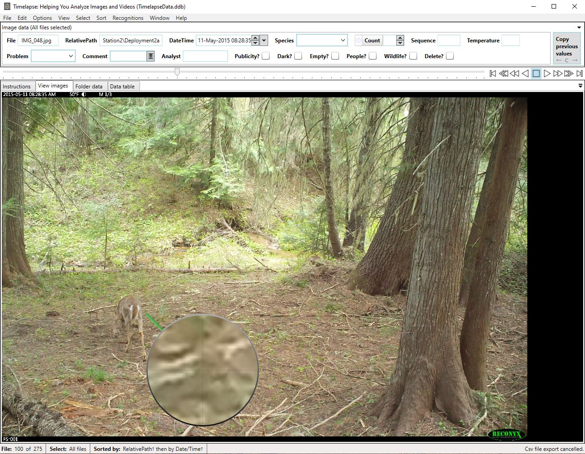

# Step 4: Reviewing and Tagging Images

The process of reviewing and tagging photos will vary depending on your image dataset and project goals. The steps below outline a generalized workflow for tagging images.

1. **Start the Timelapse software.** (This is the `Timelapse.exe` file in your Timelapse directory.)

2. **Load your template:**
   - Go to **File → Load template, images, and videos**.
   - Navigate to the root folder of your image dataset and select the Timelapse template.
   - This will load your images into Timelapse.

3. **Review and tag images:**
   - Move through each image, identifying all animals present.
   - If more than one species appears in an image or video, use **Edit → Duplicate this record** (`Ctrl+D`).
   - This will create an additional entry in the database, allowing you to annotate each species separately.

_Example of tagging images in Timelapse using the practice image set._
