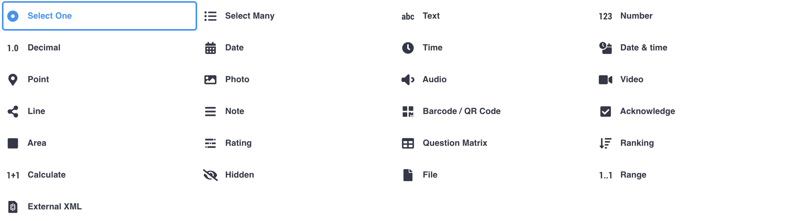

# Week 3: Data Analysis and Visualization

## **🎯 Objectives**

* Perform basic data analysis using spreadsheets.
* Utilize KoboToolbox's built-in reporting features.

## **📘 Introduction**

Analyzing collected data is crucial for informed decision-making. It is a complex and broad field. This week, you'll learn to perform basic analysis and visualize data using spreadsheets.

## **📄 Learning Materials**

* Data analysis with Spreadsheet tool:[ https://www.youtube.com/watch?v=_g5roKHj95o ](https://www.youtube.com/watch?v=_g5roKHj95o)
* [Note: ](https://www.youtube.com/watch?v=_g5roKHj95o)Aalthough this video is focused on Microsoft Excel, the same techniques apply to Google Spreadsheets or LibreOffice Calc.
* Export and Report Data from KoboToolbox:[ https://www.youtube.com/watch?v=Vo9IbQvm8Rg](https://www.youtube.com/watch?v=Vo9IbQvm8Rg)
* Pivot tables in Excel:[ https://www.youtube.com/watch?v=dvbLrwD2SpA](https://www.youtube.com/watch?v=dvbLrwD2SpA) . It is a powerful tool to analyze tabular data like the one produced through KoboToolbox. 
* Note: Aalthough this video is focused on Microsoft Excel, the same techniques apply to Google Spreadsheets or LibreOffice Calc.

## **📝 Activities**

1. **Data Cleaning:** Use Excel (or a different tool) to clean and organize your exported data.
2. **Basic Analysis:** Create pivot tables and charts to summarize data.

## **⚙️ Additional Resources from the Check-in**

### **Grouping Questions in KoboToolbox**

In the last session, we reviewed the KoboToolbox capabilities of grouping questions. Just as a reminder, grouping allows you to join together sets of questions that have the same meaning or purpose.

Additionally, you can apply skip logic to these groups of questions altogether. For example, if you create a group of questions specific to a certain group of individuals, like Toshaos or teachers, conditional logic can be applied so only those people will see those questions.

You can find out more about this functionality here: https://www.youtube.com/watch?v=DQ8vb6G-Br8

### **Data export formats**

We talked about the differences between XLS and CSV export formats, noting that while the data content is identical, XLS files are generally more straightforward to open with spreadsheet tools, while CSV is an open data format ensuring future readability.

### **Limitations of Kobo Collect vs. Web Interface**

Sandro and Kirsty shared with us their experience, stating that the web interface lacks hardware integration features like GPS and audio recording. The Android app is more robust for offline data collection and handles data submission more maturely than the web app, which can have browser-specific limitations.

On the other hand, the Kobo Collect Android app doesn't provide any review or edit submissions functionality, so it creates a very rigid workflow that if it doesn't fit your needs, might get in between your own processes.
Also, the web interface allows a frictionless experience, as little as just requiring a link to do submissions.
In practical terms, you could create a survey and export a form link that you could share with whatever group of people you are working with over email, whatsapp or any other medium, and they would be ready to do submissions right away.

At the end of the day, as you have both available, you will choose which one is best for your data collection needs.

### **Kobo Question Types**

We talked about the different question types available in KoboToolbox.
This is the link shared in the call: https://support.kobotoolbox.org/question_types.html

### **Cloning Surveys for Practice**

A good way of experimenting with KoboToolbox capabilities is to clone an existing survey and practice on the cloned one. It's also a good way to do edits that one is not safe to do. By cloning the survey into a completely new project  you leave untouched the original project and the submissions made within the within it.

### **Question library**

The Library function allows users to save groups of questions as templates for reuse across different forms. This feature is highly valuable for saving time, especially when dealing with long lists of options or frequently asked questions, as it eliminates the need to re-enter information multiple times, and also helps create certain structure amongst the surveys.

You can find out more about this feature in the [Question Library documentation](https://support.kobotoolbox.org/question_library.html).

## **Form edits and Data persistence**

 data is never lost when a form is edited; instead, Kobo creates new columns for updated questions, effectively separating the data for different versions

 Although this is the case, doing edits after starting collecting submissions makes the analysis tab unusable, because only the data that conforms to the last survey will be visualized over there. In this case, you will have to rely on external tools for Data Visualization.

 Either way, the suggested workflow assumes that Data Cleaning and Visualization happens outside of KoboToolbox.

## **Data Cleaning and External Tools**

Data cleaning is a necessary post-collection process, as KoboToolbox provides simple mechanisms that generally fall short or very labour intensive for the task. 
Other tools for exploring external tools like Spreadsheet tools (LibreOffice, Microsoft Office, Google Spreadsheets), specialized Data Cleaning tools like OpenRefine assist with this process.

This process is particularly needed when editting forms in between a data collection, as data appears separated at the end of the spreadsheet following updates, requiring manual realignment, and there is no feature within KoboToolbox to do this reconciliation.