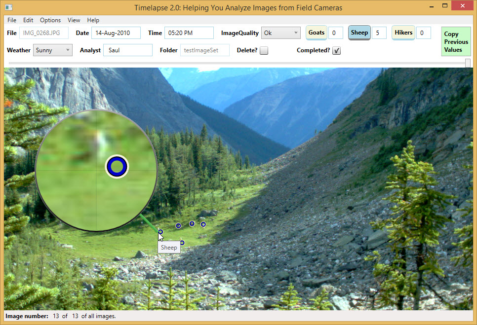

# 🐾 Guide: Setting up a Project in Timelapse

[Timelapse](https://timelapse.ucalgary.ca/) is a Windows OS software for reviewing camera trap data and transforming raw image and video files into structured data that can provide insights into species presence and population trends. This is a quick introduction to using the software.

:::note

Timelapse is actively developed, open source ([GitHub repo](https://github.com/saulgreenberg/Timelapse)), and has comprehensive documentation. For in-depth information, refer to the following resources.

:::

## Key Resources

- :house: [Timelapse Home Page](https://timelapse.ucalgary.ca/)
- :arrow_down: [Download and Installation](https://timelapse.ucalgary.ca/download/)
- :open_book: [User Guides and Tutorials](https://timelapse.ucalgary.ca/guides/)
  - **[QuickStart Guide (PDF)](https://timelapse.ucalgary.ca/wp-content/uploads/Guides/TimelapseQuickStartGuide.pdf)**  
    A hands-on guide that walks you through loading, inspecting, and tagging a practice set of images and videos.

  - **[Reference Guide (PDF)](https://saul.cpsc.ucalgary.ca/timelapse/uploads/Guides/TimelapseReferenceGuide.pdf)**  
    Covers all available features in detail. Highly recommended for optimizing your workflow.

  - **[Template Guide (PDF)](https://timelapse.ucalgary.ca/wp-content/uploads/Guides/TimelapseReferenceGuide.pdf)**  
    Explains how to create and manage templates using the Timelapse Template Editor.

  - **[Metadata Guide (PDF)](https://timelapse.ucalgary.ca/wp-content/uploads/Guides/TimelapseImageRecognitionGuide.pdf)**  
    This guide explains how to associate folder-level metadata with your image set and how to fill it in. It also includes several metadata standards.

  - **[Database Guide (PDF)](https://timelapse.ucalgary.ca/wp-content/uploads/Guides/TimelapseDatabaseGuide.pdf)**  
    Details the internal database structure. Useful if you plan to access the database directly.

- :movie_camera: [Video Tutorials](https://timelapse.ucalgary.ca/videos/)
  - **[A Whirlwind Tour of Timelapse (~16 min)](https://saul.cpsc.ucalgary.ca/timelapse/uploads/Videos/WhirlwindTourOfTimelapse.mp4)**
  - **[Video Companion: QuickStart Guide (~13 min)](https://saul.cpsc.ucalgary.ca/timelapse/uploads/Videos/Video-TimelapseQuickStartGuide.mp4)**
  - **[Video Companion: Template Guide (~7 min)](https://saul.cpsc.ucalgary.ca/timelapse/uploads/Videos/TemplateEditor.mp4)**

:::tip
There are many more resources on the [Timelapse homepage](https://timelapse.ucalgary.ca/) to explore as you become more familiar with the tool.
:::

---
