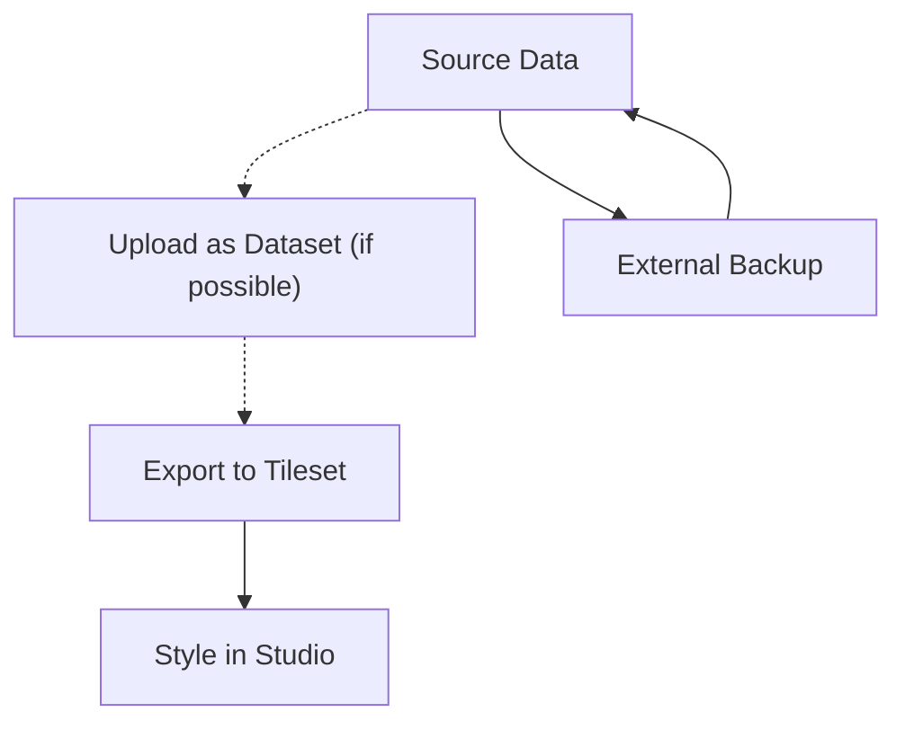

# Mapbox

O [Mapbox](https://www.mapbox.com/) é uma plataforma de mapeamento que fornece a base para mapas interativos em todas as instâncias do Guardian Connector.

## Como a Mapbox é utilizada no Guardian Connector

O Mapbox desempenha três funções principais nas implementações do Guardian Connector:

- **Tokens de acesso para mapas básicos** - Compartilhados entre as instâncias do Google Cloud para fornecer camadas de mapa básicas e funcionalidades de mapeamento padrão para ferramentas como o [Superset](/reference/gc-toolkit/superset/).
- **Estilos de mapa personalizados** – Criados no Mapbox Studio para mapas específicos ou painéis de informações em `$CODEVAR[n]` ([GC Explorer](/reference/gc-toolkit/gc-explorer/)).
- **Mapas offline** - Os estilos do Mapbox podem ser compilados em pacotes de mapas offline para uso no [CoMapeo](/reference/connected-applications/comapeo/) utilizando ferramentas como [QGIS](https://www.qgis.org/) e [MapPacker](https://github.com/conservationmetrics/mappacker).

## Compreendendo a Arquitetura de Dados do Mapbox

A Mapbox organiza dados geoespaciais por meio de três componentes principais que trabalham em conjunto para fornecer mapas interativos:

### Datasets
**Conjuntos de dados** são coleções editáveis de recursos GeoJSON armazenados no Mapbox. Eles representam os dados espaciais brutos e podem ser modificados recurso por recurso, utilizando o editor de conjuntos de dados do Mapbox Studio ou a API Datasets.

- **Caso de uso:** Armazenamento inicial de dados e atualizações contínuas
- **Formato:** Coleção de Recursos GeoJSON
- **Possibilidade de edição:** Totalmente editável (adicionar, modificar e excluir recursos e propriedades).
- **Limites de tamanho:** Não há limite para o armazenamento, mas o editor do Studio exibe apenas conjuntos de dados com tamanho inferior ou igual a 20 MB.

### Tilesets
Os "tilesets" são coleções otimizadas e pré-processadas de dados geoespaciais, divididas em uma grade uniforme de "tiles" em vários níveis de zoom (até o nível de zoom 22). Os conjuntos de dados devem ser exportados para "tilesets" antes de serem utilizados em estilos de mapas. É possível gerar "tilesets" diretamente, sem utilizar conjuntos de dados, por exemplo, arrastando e soltando dados espaciais diretamente no editor de estilo do Mapbox Studio.

- **Caso de uso:** Renderização e formatação de mapas otimizadas
- **Formato:** Tiles vetoriais (MVT) ou tiles rasterizados
- **Possibilidade de edição:** Apenas leitura após o processamento.
- **Desempenho**: Altamente otimizado e com grande uso de cache, para carregamento rápido.

### Styles
**Estilos** definem a aparência visual dos mapas, utilizando a [Especificação de Estilo do Mapbox](https://docs.mapbox.com/style-spec/). Eles fazem referência a conjuntos de tiles como fontes de dados e aplicam regras de estilo para criar a aparência final do mapa.

- **Formato:** Documento JSON (style.json)
- **Componentes:** Fontes de dados, camadas, propriedades de estilo, fontes e sprites.
- **Possibilidade de edição:** Pode ser alterado no Mapbox Studio ou por meio de programação.

## Gerenciamento de Dados com Base em Contas

Todos os dados do Mapbox (conjuntos de dados, conjuntos de tiles, estilos) estão vinculados a contas específicas do Mapbox, o que exige considerações importantes de gerenciamento:

- **Propriedade da conta:** Os dados não podem ser transferidos entre contas sem processos explícitos de exportação/importação.
- **Dependências de cobrança:** Contas não pagas podem perder o acesso a dados e ter a funcionalidade de mapa desativada.
- **Controle de acesso:** Estilos e conjuntos de tiles privados só podem ser acessados com tokens de acesso válidos da conta proprietária.

### Considerações para a configuração da conta

**Nomenclatura organizacional:** Ao configurar contas do Mapbox para instâncias do Guardian Connector, utilize nomes organizacionais como ``OrganizationName-GC`` em vez de nomes pessoais. Isso é crucial porque os IDs de conta não podem ser alterados após a criação, e os tokens de acesso não são transferíveis entre as contas.

**Implementações para múltiplos clientes:** Para organizações que gerenciam várias instâncias do Guardian Connector para diferentes clientes, configure contas Mapbox exclusivas para cada cliente. Essa configuração de 1:1 permite:
- Os clientes deverão assumir a propriedade futura de suas contas.
- Acesso independente a estatísticas de uso para seus projetos  
- Gerenciamento de cobranças diretas
- Cada cliente receberá sua própria camada gratuita de chamadas de API.

:::dica 

O Mapbox permite o uso de alias adicionais (como ``your-email+mapbox-1@example.com``, ``your-email+mapbox-2@example.com``, etc.) para os nomes das contas. Essa é uma boa prática, pois facilita o gerenciamento das contas.

:::

Para obter orientações abrangentes sobre a configuração de contas e colaboração, consulte [Melhores práticas de colaboração da Mapbox](https://docs.mapbox.com/help/troubleshooting/collaboration-best-practices/).

### Limitações na portabilidade de dados

**Estilos**
- **Estilos públicos:** Podem ser copiados por outros usuários através de links compartilháveis
- **Estilos personalizados:** Devem ser baixados no formato JSON e carregados manualmente em novas contas.
- **Recursos personalizados:** Fontes e ícones precisam ser transferidos separadamente.

**Conjuntos de texturas**
- **Conjuntos de tiles públicos:** Podem ser referenciados por outras contas, mas não são realmente transferidos.
- **Conjuntos de texturas privados:** Não podem ser copiados diretamente; exigem o reenvio dos dados originais.
- **Risco de perda de dados**: Se os dados originais forem perdidos, não será possível reconstruir os conjuntos de tiles.

## Estratégias para o upload e a preservação de dados

A Mapbox oferece várias maneiras de adicionar dados à sua conta, cada uma com diferentes implicações para a preservação dos dados:

**Upload direto para o editor de estilo:**
- **Processo:** Arraste e solte dados espaciais diretamente no editor de estilo do Mapbox Studio.
- **Resultado:** Os dados são convertidos imediatamente em conjuntos de tiles, sem a necessidade de conjuntos de dados intermediários.
- **Risco:** Os dados originais não são preservados e não podem ser recuperados.

**Abordagem focada nos dados (recomendado):**
- **Processo:** Enviar os dados como um conjunto de dados → editar, se necessário → exportar para um conjunto de imagens → aplicar estilos no Studio.
- **Resultado:** Mantém tanto os dados brutos (conjunto de dados) quanto os dados otimizados (conjunto de tiles).
- **Vantagens:** Os dados permanecem editáveis e recuperáveis

Para obter mais informações sobre as diferenças entre essas abordagens, consulte a documentação da Mapbox intitulada "Enviar dados para a Mapbox" ([https://docs.mapbox.com/help/troubleshooting/uploads/](https://docs.mapbox.com/help/troubleshooting/uploads/)).

### Fluxo de Trabalho Recomendado

**Melhores práticas para a preservação de dados:**
1. **Mantenha sempre cópias de segurança externas** dos dados originais em um sistema de controle de versão ou armazenamento na nuvem.
2. **Faça o upload como conjuntos de dados primeiro**, se possível, para preservar a capacidade de edição e os dados originais.
3. **Fontes de dados** e fluxos de trabalho de processamento
4. **Exportar para conjuntos de texturas** somente quando os dados estiverem finalizados para o estilo desejado.
5. Arquivos JSON de controle de versão, sempre que possível.

## Como começar

1. Crie uma conta no Mapbox em [mapbox.com](https://www.mapbox.com/)
2. Gere um token de acesso para a sua implantação do Guardian Connector.
3. Configure o token de acesso no seu ambiente do GC Explorer e Superset, utilizando as variáveis de ambiente.
4. Opcionalmente, crie estilos de mapa personalizados no Mapbox Studio para visualizações e painéis específicos.

::: Aviso: Melhores Práticas de Segurança

Sempre limite o acesso à sua chave de API da Mapbox a URLs e fontes específicas para evitar o uso não autorizado. Configure as restrições de URL nas configurações da sua conta na Mapbox.

## Documentação relacionada

- [Manual do Mapbox Studio](https://docs.mapbox.com/studio-manual/) – Guia completo sobre gerenciamento e estilização de dados.
- [Especificação de Estilo do Mapbox](https://docs.mapbox.com/style-spec/) - Especificação técnica para estilos de mapa
- [Gerenciamento de Conta do Mapbox](https://docs.mapbox.com/accounts/guides/) - Configurações da conta e configurações de segurança
- [Solução de problemas na importação de dados](https://docs.mapbox.com/help/troubleshooting/uploads/) - Problemas comuns e soluções na importação